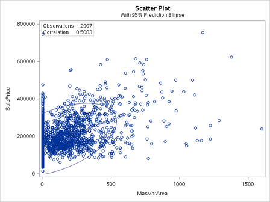
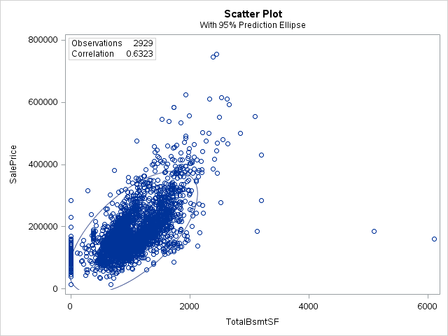
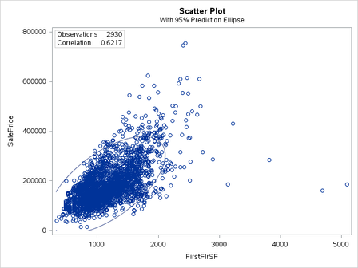
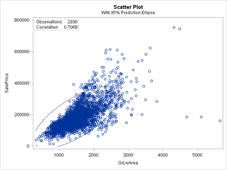
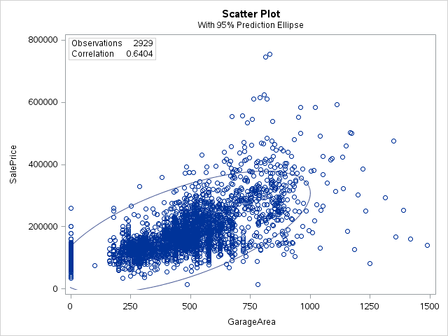
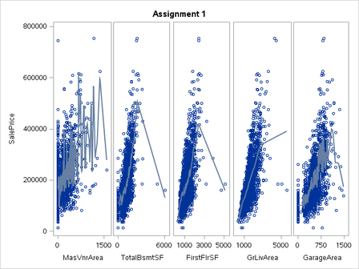

% Assignment 1: Exploratory Data Analysis
% Andrew G. Dunn^1^
% ^1^andrew.g.dunn@u.northwestern.edu

\vfill

**Andrew G. Dunn, Northwestern University Predictive Analytics Program**

Prepared for PREDICT-410: Regression & Multivariate Analysis.

Formatted using the \LaTeX\, references managed using pandoc-citeproc.

\newpage

# Examine the Variables in the Ames Housing Data Set

We will initially load the data set from the provided location. We're lucky that
this data set is already on the system and doesn't require an pre-processing or
data munging before load.

~~~{.fortran}
title 'Assignment 1';
libname mydata '/scs/crb519/PREDICT_410/SAS_Data/' access=readonly;

*create temporary variable (data source is read only);
data ames;
    set mydata.ames_housing_data;
run;
~~~

We notice, by looking in the log, two important bounding characteristics of our
overall data set:

    NOTE: There were 2930 observations read from the data set MYDATA.AMES_HOUSING_DATA.
    NOTE: The data set WORK.AMES has 2930 observations and 82 variables.

We know, from the assignment description, that we have available a data
dictionary. We will consult this dictionary as soon as our exploration brings us
to the point where we need clarification about a categorical variable or another
ambiguity in the data collection.

## Which Variables are Continuous and Which are Categorical? Are some Variables In-Between?

We can use the SAS procedure 'contents' to examine a list of the variables and
their types, lenghts, and formats respectively.

~~~{.fortran}
proc contents data=ames order=varnum;
~~~

From this we see that our 82 variables have a handful of types, lengths and
formats. We could use SAS to investigate further, however we were graciously
provided with a data dictionary to go along with the data set.

From this data dictionary we do a quick find to tally up how many different
types of variables we have, and produce this table:

| Type  | Tally  |
|:-:|:-:|
| discrete | 15  |
| nominal | 24  |
| continuous | 20  |
| ordinal | 23 |

The data dictionary makes it much more clear to understand what the variables
intend to represent. Without this resource we would likely have to spend a great
deal of time examining the individual variables trying to infer what their
individual meanings are. This would likely result in the rejection or, just
plain elimination of variables out of frustration by the analyst.

## Can We Develop a Model to Predict Sales Price from this Data Set?

We examine using the corr procedure to see if there are any variables that have
a low $p$-value in relation to saleprice.

We will start with a list of all continuous variables:

    LotFrontage LotArea MasVnrArea BsmtFinSF1 BsmtFinSF2 BsmtUnfSF TotalBsmtSF
    FirstFlrSF SecondFlrSF LowQualFinSF GrLivArea GarageArea WoodDeckSF OpenPorchSF
    EnclosedPorch ThreeSsnPorch ScreenPorch PoolArea MiscVal

~~~{.fortran}
* initial examination of the correlation to saleprice;
proc corr data=ames nosimple;
    var saleprice;
    with LotFrontage LotArea MasVnrArea BsmtFinSF1 BsmtFinSF2 BsmtUnfSF TotalBsmtSF
    FirstFlrSF SecondFlrSF LowQualFinSF GrLivArea GarageArea WoodDeckSF OpenPorchSF
    EnclosedPorch ThreeSsnPorch ScreenPorch PoolArea MiscVal;
~~~

From here we down select to the set of variables with a low $p$-value.

    LotFrontage LotArea MasVnrArea BsmtFinSF1 BsmtUnfSF TotalBsmtSF FirstFlrSF
    SecondFlrSF GrLivArea GarageArea WoodDeckSF OpenPorchSF EnclosedPorch
    ScreenPorch PoolArea

All, except for PoolArea, have a $p$-value of $< 0.0001$. Pool Area has a
$p$-value of $0.0002$. Of these correlations, only a handful have strong pearson
correlation coefficients, where most are close to 0. Due to this we down select
even further:

    MasVnrArea BsmtFinSF1 BsmtUnfSF TotalBsmtSF FirstFlrSF GrLivArea GarageArea

So from a simple pearson correlation on the available continuous variables in
this data set we are able to narrow down to seven variables of interest.

# Examine Continuous Variables to Look for Questionable Observations

We will examine some variables, specifically the continuous, to looks for
questionable observations. We use the sort procedure to examine the largest and
smallest observations.

## Examine Sales Price

Using the sort procedure for sales price:

~~~{.fortran}
proc sort data=ames out=sorted;
   by saleprice;

proc print data=sorted;
    var saleprice;
~~~

We see that both the highest and lowest observations appear to be within what we
would consider to be a reasonable range. It is interesting, and potentially
something to be examined further, that the lowest two values are almost a half
lower than the third lowest value in the observations.

## Examine LotFrontage

We're going to look at variables that we've already eliminated from model
perspective, mainly because we found interesting results in the both LotFrontage
and LotArea.

We see from the data dictionary that lotFrontage is an observation of linear
feet of street connected to property. Using the sort procedure for LotFrontage:

~~~{.fortran}
proc sort data=ames out=sorted;
   by LotFrontage;

proc print data=sorted;
    var LotFrontage;
~~~

We see that the first 490 observations appear to be null for this variable. As
we currently are not modifying the data set, we will not drop observations that
are null.

## Examine LotArea

We see from the data dictionary that LotArea is an observation of Lot size in
square feet. Using the sort procedure for LotArea:

~~~{.fortran}
proc sort data=ames out=sorted;
   by LotArea;

proc print data=sorted;
    var LotArea;
~~~

We see that the highest four observations are significantly larger than the rest
of the observations.

## Questionable Observations Cleanup

Normally we would seek to eliminate the questionable observations before the
construction of our model. In this case we will leave in what we observed as we
don't have any guidance as to what thresholds we may eliminate observations
with. The act of Data Wrangling [@wiki:wrangling] or Munging [@wiki:mung] is an
incredibly time consuming exercise that is necessary before we begin
constructing models. There has been an up-tick in language popularity for tools
like python and julia due to their relative ease in processing data prior to
building models. When the analyst is confronted with a tedious task, such as
prepping and cleaning data, they will seek the most expressive and powerful
tools to do this [@muenchen2012pop], [@muenchen2012end].

# Investigate Potential Continuous Predictor Variables, with respect to Sales Price

We run the Pearson correlation on the variables that we down selected during our
exploratory data analysis phase.

~~~{.fortran}
proc corr data=ames nosimple rank;
   var MasVnrArea BsmtFinSF1 BsmtUnfSF TotalBsmtSF FirstFlrSF GrLivArea GarageArea;
   with SalePrice;
~~~

We get results for the variables as follows:

| Variable  | Pearson Correlation Coefficients  | Prob > $|r|$ under $H_0$: $\rho$=0 | Number of Observations |
|:-:|:-:|:-:|:-:|
| GrLivArea | 0.70678 | <.0001 | 2930 |
| GarageArea | 0.64040 | <.0001 | 2929 |
| TotalBsmtSF | 0.63228 | <.0001 | 2929 |
| FirstFlrSF | 0.62168 | <.0001 | 2930 |
| MasVnrArea | 0.50828 | <.0001 | 2907 |
| BsmtFinSF1 | 0.43291 | <.0001 | 2929 |
| BsmtUnfSF | 0.18286 | <.0001 | 2929 |

From here we then down select further to the five variables that have a
correlation coefficient greater than $|0.5|$.

    MasVnrArea TotalBsmtSF FirstFlrSF GrLivArea GarageArea

Even though we've down selected based on $p$-value and Pearson correlation
coefficient, these criteria are not alone enough to indicate whether we should
use a particular variable as the predictor variable. We will need to examine
further with more tools available to us.

We provide graphs of the five variables from the corr process:

~~~{.fortran}
proc corr data=ames nosimple rank plots=(scatter);
   var MasVnrArea TotalBsmtSF FirstFlrSF GrLivArea GarageArea;
   with SalePrice;
~~~

\newpage

# Visualization of Selected Continuous Predictor Variables

We will further examine the variables above by graphing them as scatterplots and
overlaying the Locally Estimated Scatter plot Smoother (LOESS). We notice that
even though these variables had good Pearson correlation coefficients that the
LOESS overlay for TotalBsmntSF, FirstFlrSF, and GrLivArea indicate chasing of
some outlier. While the LOESS overlay for MsVnrArea and GarageArea look closer
to what we'd expect from a regression line (a general trend in the correlation
direction), even though they each seem to vector towards an outlier at the end.

~~~{.fortran}
proc sgscatter data=ames;
    compare x=(MasVnrArea TotalBsmtSF FirstFlrSF GrLivArea GarageArea)
            y=saleprice / loess;
~~~

# Conclusion / Reflection

The Exploratory Data Analysis that we've done indicates that there are some
interesting variables to be examined for construction of a model. There are many
parts of the data set that have missing values for observations. Much of the
data set is categorical, and at this time we don't have strong conclusions about
whether these categorical variables will be valuable predictors.

The relatively erratic LOESS overlay may be an indicator that we should consider
transformation of our predictor variables. A smother LOESS overlay should give
us and indication of whether the relationship is approximately linear. Instead
of using scatter plots we could also consider using kernel density plots.

SAS itself made this exploratory data analysis much more challenging than if I
personally was using python or R. The community for SAS is more commercial,
where as both python and R have an academic and open source community to go and
discuss challenges with for relatively instant feedback.

\newpage

# References