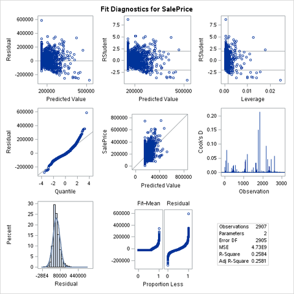
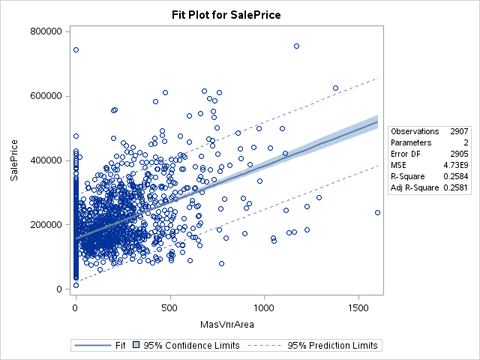
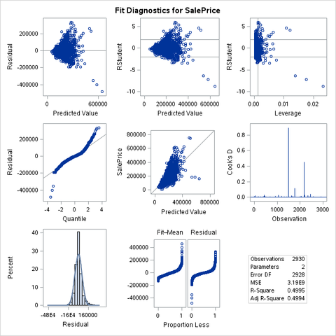
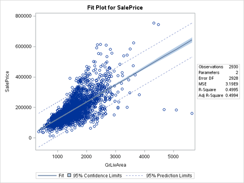
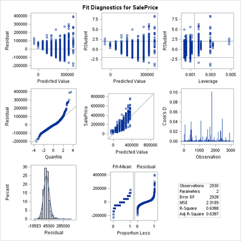
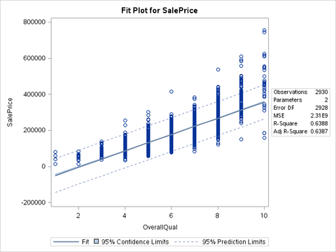
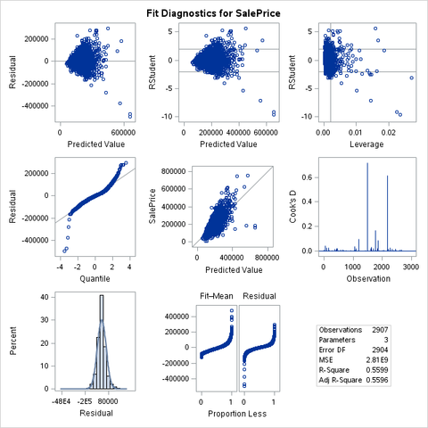

% Assignment 2: Regression Model Building
% Andrew G. Dunn^1^
% ^1^andrew.g.dunn@u.northwestern.edu

\vfill

**Andrew G. Dunn, Northwestern University Predictive Analytics Program**

Prepared for PREDICT-410: Regression & Multivariate Analysis.

Formatted using markdown, pandoc, and \LaTeX\. References managed using Bibtex,
and pandoc-citeproc.

\newpage

# Simple Linear Regression Models

We'll build upon our EDA, where we found the following continuous variables:

| Continuous Variable  | Correlation to SalePrice | Prob > $|r|$ under $H_0$: $\rho$=0 | Number of Observations |
|:-:|:-:|:-:|:-:|
| GrLivArea | 0.70678 | <0.0001 | 2930 |
| GarageArea | 0.64040 | <0.0001 | 2929 |
| TotalBsmtSF | 0.63228 | <0.0001 | 2929 |
| FirstFlrSF | 0.62168 | <0.0001 | 2930 |
| MasVnrArea | 0.50828 | <0.0001 | 2907 |
| BsmtFinSF1 | 0.43291 | <0.0001 | 2929 |
| BsmtUnfSF | 0.18286 | <0.0001 | 2929 |

And first choose to model MasVnrArea, which correlated approximately 0.5 with
SalePrice and had almost all of the total observations included. We will use
this variable to build a simple linear regression model and comment on the model
adequacy.

Second we'll choose GrLivArea, which from our EDA was was found to linearly
correlate with SalePrice better than MasVnrArea.

Thirdly we will look at the categorical variables;

| Categorical Variable  | Correlation to SalePrice | Prob > $|r|$ under $H_0$: $\rho$=0 | Number of Observations |
|:-:|:-:|:-:|:-:|
| OverallQual | 0.79926 | <0.0001 | 2930 |
| GarageCars | 0.64788 | <0.0001 | 2929 |
| YearBuilt | 0.55843 | <0.0001 | 2930 |
| FullBath | 0.54560 | <0.0001 | 2930 |
| YearRemodel | 0.53297 | <0.0001 | 2930 |
| GarageYrBlt | 0.52697 | <0.0001 | 2771 |
| Fireplaces | 0.47456 | <0.0001 | 2930 |

From this we choose OverallQual, which rates the overall material and finish of
the house. It rates on a 10 level Lickert scale [@wiki:likert], 10 being Very
Excellent. and 1 being Very Poor.

\newpage

## Model: MasVnrArea predicts SalePrice

The model of interest is $$ \text{SalePrice} = \beta_0 + \beta_1\text{MasVnrArea} + \epsilon$$

We use the SAS Simple Linear Regression procedure 'reg':

~~~{.fortran}
proc reg;
  model SalePrice = MasVnrArea;
run;
~~~

Which yields the parameters estimates:

| Variable | DF | Parameter Estimate | Standard Error | t Value | $\text{Pr} > |t|$ |
|:-:|:-:|:-:|:-:|:-:|:-:|
| Intercept | 1 | 157303 | 1466.89502 |107.24 | <0.0001 |
| MasVnrArea | 1 | 226.47763 | 7.11940 | 31.81 | <0.0001 |

As such, our fitted model is $$\text{SalePrice} = 157303 + 226.47763 \times \text{MasVnrArea}$$

Within the context of these variables, the model coefficients indicate that if
MasVnrArea was 0 the SalePrice of the house would be $157,303. We look into our
data dictionary to find that MasVnrArea is described ambiguously as 'Masonry
veneer area in square feet'. We state ambiguously because when we examine other
variables within the data dictionary we find Exterior 1, Exterior 2, and
MasVnrType. These categorical variables show us that there can be multiple
exterior finishes, and logically only a subset of those finishes are considered
within the MasVnrType variable. At this time, before looking at any graphs, we
will suspect to see many observations where MasVnrArea is 0. Therefor, a sale
price of $157,303 is likely reasonable in this model because there are likely
many observations in this data set that have a SalePrice and do not have a
masonry veneer. This does make us feel quite poorly about the model, as it's
likely that even though we have 2907 observations, only a subset of those
observations will be representative of the phenomena we desire to model.

A one unit change in MasVnrArea should be consistent (it is a continuous
variable), and the average change in the mean of SalePrice is about $226.

Both variables have t values that are significantly large ($|t| > 0$) with
significant p-values that allow us to reject the null hypothesis and conclude
that each of these variables have slope and intercept that are greater than
zero.

The model also has some goodness-of-fit information:

| Source | DF | Sum of Squares | Mean Square | F Value | $\text{Pr} > F$ |
|:-:|:-:|:-:|:-:|:-:|:-:|
| Model | 1 | 4.781879E12 | 4.781879E12 | 1011.96 | <0.0001 |
| Error | 2905 | 1.372718E13 | 4725361826 | | |
| Corrected Total | 2906 | 1.850905E13 | | | |

We look at our F Value and realize that because it is large (greater than 1) the
observations and regression will differ from the grand mean. There is some
angle, and some linear association with the observations. From the $\text{Pr} >
|t|$  we reject the null hypothesis, and the alternative is that there is a
linear relationship between MasVnrArea and SalePrice.

| Source | |
|:-:|:-:|
| Root MSE | 68741 |
| Dependent Mean | 180380 |
| Coeff Var | 38.10908 |
| R-Square | 0.2584 |
| Adj R-Square | 0.2581 |

We look at our R-Square to see that this regression model only explains ~25% of
the variability in SalePrice using MasVnrArea. We will pay attention to the
Adjusted R-Square as we continue to build models so that we can compare model
performance with consideration to the size of the sample and number of variables
are included in the model.

We'll now look at the ODS graphics output for both the Fit Diagnostics and Fit
Plot:

We assess the normality of residuals by examining the Q-Q plot and observe that
the the plot is heavy tailed. From this we conclude that the observations do not
follow the assumed distribution. It is alarming to see that there is a
significant outlier in the top right section of the graph. We might be able to
live with that outlier, however many observations show up as heavily tailed.

This becomes more of a complication as we observe the histogram of residuals. It
appears that the data is mostly normal within this depiction. We at this time
have some conflicting feelings based on the two graphs.

We lastly look at the Cook's D. We seek guidance about reading the Cook's D plot
and find [@fox1991regression] says: "values of D that are substantially larger
than the rest". We also find that there is some conventional wisdom for
establishing thresholds for Cook's D using $$\frac{4}{(N-k-1)}$$ where $N$ is the number
of observations and $k$ is the number of explanatory variables. From this our
threshold is computed to be $\frac{4}{2906 - 1 - 1} = 0.0013$. We see that there are
multiple spikes in the Cook's D over this threshold which should indicate that
there are some observations that uniquely influential.

It's safe to say that this model is not homoscedastic due to the above mentioned
observations of the graphs. It's important to mention that without the
diagnostic graphics we would not have been able to make an assessment of
homoscedasticity.

Generally appears to be a positive linear trend, if we ignore that many of the
observations for MasVnrArea are at 0. Overall there are some things that we
don't like about this model, likely due to many observations of MasVnrArea being
zero. We'll look at some other variables to see if we can construct a model that
gives us some better feelings about explaining SalePrice.

\newpage

## Model: 'Best' Continuous Variable using R-Square Selection

The model of interest is $$ \text{SalePrice} = \beta_0 + \beta_1\text{'Best'} + \epsilon$$

We use the SAS Simple Linear Regression procedure 'reg' with a selection based
on the r-square metric:

~~~{.fortran}
proc reg;
  model SalePrice = GrLivArea GarageArea TotalBsmtSF FirstFlrSF MasVnrArea BsmtFinSF1 BsmtUnfSF/
    selection=rsquare start=1 stop=1;
run;
~~~

Which yields the model comparison:

| R-Square | Variables in Model |
|:-:|:-:|
| 0.5006 | GrLivArea |
| 0.4085 | GarageArea |
| 0.4002 | TotalBsmtSF |
| 0.3885 | FirstFlrSF |
| 0.2582 | MasVnrArea |
| 0.1876 | BsmtFinSF1 |
| 0.0334 | BsmtUnfSF |

We then look at the parameter estimates for GrLivArea:

| Variable | DF | Parameter Estimate | Standard Error | t Value | $\text{Pr} > |t|$ |
|:-:|:-:|:-:|:-:|:-:|:-:|
| Intercept | 1 | 13290 | 3269.70277 |4.06 | <0.0001 |
| GrLivArea | 1 | 111.69400 | 2.06607 | 54.06 | <0.0001 |

As such, our fitted model is $$\text{SalePrice} = 13290 + 111.69400 \times \text{GrLivArea}$$

Within the context of these variables, the model coefficients indicate that if
GrLivArea was 0 the SalePrice of the house would be $13,290. Coming from the
variable of MasVnrArea, which from the data dictionary we saw was likely to have
many observations be null, we feel stronger about this variable. It is highly
likely that there will not be observations in our data set that will be null for
this particular variable.

A one unit change in GrLivArea should be consistent (it is a continuous
variable), and the average change in the mean of SalePrice is about $111.70.

Both variables have t values that are significantly large ($|t| > 0$) with
significant p-values that allow us to reject the null hypothesis and conclude
that each of these variables have slope and intercept that are greater than
zero.

The model also has some goodness-of-fit information:

| Source | DF | Sum of Squares | Mean Square | F Value | $\text{Pr} > F$ |
|:-:|:-:|:-:|:-:|:-:|:-:|
| Model | 1 | 9.3763E12 | 9.33763E12 | 2922.59 | <0.0001 |
| Error | 2928 | 9.354907E12 | 3194981962 | | |
| Corrected Total | 2929 | 1.869254E13 | | | |

We look at our F Value and realize that because it is large (greater than 1) the
observations and regression will differ from the grand mean. There is some
angle, and some linear association with the observations. From the $\text{Pr} >
|t|$  we reject the null hypothesis, and the alternative is that there is a
linear relationship between GrLivArea and SalePrice.

| Source | |
|:-:|:-:|
| Root MSE | 56524 |
| Dependent Mean | 180796 |
| Coeff Var | 31.26405 |
| R-Square | 0.4995 |
| Adj R-Square | 0.4994 |

We look at our R-Square to see that this regression model only explains ~50% of
the variability in SalePrice using GrLivArea. We will pay attention to the
Adjusted R-Square as we continue to build models so that we can compare model
performance with consideration to the size of the sample and number of variables
are included in the model.

\newpage

We'll now look at the ODS graphics output for both the Fit Diagnostics and Fit
Plot:

We assess the normality of residuals by examining the Q-Q plot and observe that
the the plot is heavy tailed. From this we conclude that the observations do not
follow the assumed distribution. It is alarming to see that there is a
significant outliers in the bottom left of the graph. We might be able to
live with some outliers, however many observations show up as heavily tailed.

This becomes more of a complication as we observe the histogram of residuals. It
appears that the data is mostly normal within this depiction. We at this time
have some conflicting feelings based on the two graphs.

We lastly look at the Cook's D. From the above mentioned equation, our threshold
is computed to be $\frac{4}{2930 - 1 - 1} = 0.0013$. We see that there are
multiple spikes in the Cook's D over this threshold which should indicate that
there are some observations that uniquely influential. Particularly three
observations, which if we were able to investigate further, which may be the
three outliers that are depicted in the bottom left of the Q-Q plot.

It's safe to say that this model is not homoscedastic due to the above mentioned
observations of the graphs. It's important to mention that without the
diagnostic graphics we would not have been able to make an assessment of
homoscedasticity.

\newpage

Generally appears to be a positive linear trend. Compared to the model using
MasVnrArea we feel much better about how this model 'looks', even with the above
mentioned conclusion that the model isn't homoscedastic. This being the 'best'
continuous variable for us to use with a simple linear regression is a bit
frighting, even simply examining the Adj R-Square value we can only explain 50%
of the variability in our predictor. We may find that a categorical variable, or
a more complex model will result in more explanation of variability.

\newpage

## Model: OverallQual predicts SalePrice

The model of interest is $$ \text{SalePrice} = \beta_0 + \beta_1\text{OverallQual} + \epsilon$$

We use the SAS Simple Linear Regression procedure 'reg':

~~~{.fortran}
proc reg;
  model SalePrice = OverallQual;
run;
~~~

Which yields the parameters estimates:

| Variable | DF | Parameter Estimate | Standard Error | t Value | $\text{Pr} > |t|$ |
|:-:|:-:|:-:|:-:|:-:|:-:|
| Intercept | 1 | -95004 | 3933.82223 | -24.15 | <0.0001 |
| OverallQual | 1 | 45251 | 628.80511 | 71.96 | <0.0001 |

As such, our fitted model is $$\text{SalePrice} =  45251 \times \text{OverallQual} - 95004$$

Within the context of these variables, the model coefficients indicate that if
OverallQal was 0 the SalePrice of the house would be $-95,004. As OverallQual is
categorical, and as its a 10 way Lickert scale that begins with 1, it is not
reasonable to think of OverallQual being 0.

OverallQual is a categorical variable, a one unit change will result in a much
larger jump than the previous continuous variables. If there is a one unit
change, our model tells us that the average change in the mean of SalePrice is
about \$45,251. Quite a large slope on this due to the categorical variable
being between $[1,10]$.

Both variables have t values that are significantly large ($|t| > 0$) with
significant p-values that allow us to reject the null hypothesis and conclude
that each of these variables have slope and intercept that are greater than
zero.

The model also has some goodness-of-fit information:

| Source | DF | Sum of Squares | Mean Square | F Value | $\text{Pr} > F$ |
|:-:|:-:|:-:|:-:|:-:|:-:|
| Model | 1 | 1.194116E13 | 1.194116E13 | 5178.75 | <0.0001 |
| Error | 2928 | 6.751381E12 | 2305799679 | | |
| Corrected Total | 2929 | 1.869254E13 | | | |

We look at our F Value and realize that because it is large (greater than 1) the
observations and regression will differ from the grand mean. There is some
angle, and some linear association with the observations. From the $\text{Pr} >
|t|$  we reject the null hypothesis, and the alternative is that there is a
linear relationship between OverallQual and SalePrice.

\newpage

| Source | |
|:-:|:-:|
| Root MSE | 48019 |
| Dependent Mean | 180796 |
| Coeff Var | 26.55962 |
| R-Square | 0.6388 |
| Adj R-Square | 0.6387 |

We look at our R-Square to see that this regression model only explains ~64% of
the variability in SalePrice using OverallQual. We will pay attention to the
Adjusted R-Square as we continue to build models so that we can compare model
performance with consideration to the size of the sample and number of variables
are included in the model.

We'll now look at the ODS graphics output for both the Fit Diagnostics and Fit
Plot:

We assess the normality of residuals by examining the Q-Q plot and observe that
the the plot is heavy tailed. From this we conclude that the observations do not
follow the assumed distribution. It is alarming to see that there is a
significant outliers in the top right section of the graph. We might be able to
live with that outlier, however many observations show up as heavily tailed.

This becomes more of a complication as we observe the histogram of residuals. It
appears that the data is mostly normal within this depiction. We at this time
have some conflicting feelings based on the two graphs.

We lastly look at the Cook's D. From the above mentioned equation, our threshold
is computed to be $\frac{4}{2929 - 1 - 1} = 0.0013$. We see that there are
multiple spikes in the Cook's D over this threshold which should indicate that
there are some observations that uniquely influential. In this case there are
many observations that are particularly influential.

It's safe to say that this model is not homoscedastic due to the above mentioned
observations of the graphs. It's important to mention that without the
diagnostic graphics we would not have been able to make an assessment of
homoscedasticity.

Generally appears to be a positive linear trend. Compared to the two previous
continuous variable models we've built, this model looks quite linear with the
largest amount of variability in observation of sale price coming from when a
house is rated a 10. Intuitively we'd expect for there to be some high priced
outliers that, due to the survey characterization method, would have to be
assigned a value of 10. It is interesting to see that there are some outliers at
6, 9, and 10, with some even being low outliers at 10.

If we are to simply compare models based on Adj R-Square values, this model
explains the most amount of variability in SalePrice at 64%. Even though this is
a categorical variable, and we personally have a bias towards using a continuous
variable, we find this to be a highly associative variable.

\newpage

## Simple Linear Model Comparison

We've already commented on how we generally feel about each model towards the
end of the section. Here we will compare the diagnostic statistics from each
model:

| Model | Adj R-Square | F Value |
|:-:|:-:|:-:|
|$\text{SalePrice} = 157303 + 226.47763 \times \text{MasVnrArea}$| 0.2581 | 1011.96 |
|$\text{SalePrice} = 13290 + 111.69400 \times \text{GrLivArea}$| 0.4994 | 2922.59 |
|$\text{SalePrice} =  45251 \times \text{OverallQual} - 95004$| 0.6387 | 5178.75 |

If we solely look at these criteria, then we would conclude that the model that
was 'best' based on explanation of variability in SalePrice would be the model
that uses OverallQual as the explanatory variable. We can also look at the F
Value to see that the model using OverallQual also best fits the population from
which the data were sampled.

We've already stated our reservations about using a categorical variable,
however within the available variables of this data set, the categorical
variable was both linear and highly associative meaning it was a good variable
for our modeling approach.

\newpage

# Multiple Linear Regression Models

## Model: GrLivArea, MasVnrArea predicts SalePrice

The model of interest is $$ \text{SalePrice} = \beta_0 + \beta_1\text{GrLivArea} + \beta_2\text{MasVnrArea}+ \epsilon$$

We use the SAS Simple Linear Regression procedure 'reg':

~~~{.fortran}
proc reg;
  model SalePrice = GrLivArea MasVnrArea;
run;
~~~

Which yields the parameters estimates:

| Variable | DF | Parameter Estimate | Standard Error | t Value | $\text{Pr} > |t|$ |
|:-:|:-:|:-:|:-:|:-:|:-:|
| Intercept | 1 | 26547 | 3141.93715 | 8.45 | <0.0001 |
| GrLivArea | 1 | 94.60302 | 2.12104 | 44.60 | <0.0001 |
| MasVnrArea | 1 | 118.54695 | 5.99550 | 19.77 | <0.0001 |

As such, our fitted model is $$\text{SalePrice} =  26547 + 94.6032 \times \text{GrLivArea} + 118.54695 \times \text{MasVnrArea}$$

Within the context of these variables, the model coefficients indicate that if
GrLivArea was 0, and MasVnrArea was 0 the SalePrice of the house would be
$26,547. We've interpreted both GrLivArea and MasVnrArea in the previous
sections. It's unlikely that GrLivArea would ever be 0, however it is possible
that MasVnrArea could be 0. The benefit of performing a previous simple linear
regression with each of these variables is that we had the opportunity to see
some descriptive graphics about the simple model performance. In the event that
we didn't have access to a data dictionary the only way to catch MasVnrArea
having 0 in many observations would be to have seen the diagnostic graph.

A one unit change in GrLivArea and MasVnrArea should be consistent (both are
continuous variables), and the average change in the mean of SalePrice is about
$213.14.

Both variables have t values that are significantly large ($|t| > 0$) with
significant p-values that allow us to reject the null hypothesis and conclude
that each of these variables have slope and intercept that are greater than
zero.

The model also has some goodness-of-fit information:

| Source | DF | Sum of Squares | Mean Square | F Value | $\text{Pr} > F$ |
|:-:|:-:|:-:|:-:|:-:|:-:|
| Model | 2 | 1.036256E13 | 5.181279E12 | 1846.98 | <0.0001 |
| Error | 2904 | 8.146497E12 | 2805267561 | | |
| Corrected Total | 2906 | 1.850905E13 | | | |

We look at our F Value and realize that because it is large (greater than 1) the
observations and regression will differ from the grand mean. There is some
angle, and some linear association with the observations. From the $\text{Pr} >
|t|$  we reject the null hypothesis, and the alternative is that there is a
linear relationship between GrLivArea and MasVnrArea, and SalePrice.

| Source | |
|:-:|:-:|
| Root MSE | 52965 |
| Dependent Mean | 180380 |
| Coeff Var | 29.36284 |
| R-Square | 0.5599 |
| Adj R-Square | 0.5596 |

We look at our R-Square to see that this regression model only explains ~56% of
the variability in SalePrice using GrLivArea and MasVnrArea. We will pay
attention to the Adjusted R-Square as we continue to build models so that we can
compare model performance with consideration to the size of the sample and
number of variables are included in the model.

We'll now look at the ODS graphics output for both the Fit Diagnostics and Fit
Plot:

We assess the normality of residuals by examining the Q-Q plot and observe that
the the plot is heavy tailed. From this we conclude that the observations do not
follow the assumed distribution. It is alarming to see that there is significant
outliers in the bottom left section of the graph.

This becomes more of a complication as we observe the histogram of residuals. It
appears that the data is mostly normal within this depiction. We at this time
have some conflicting feelings based on the two graphs.

We lastly look at the Cook's D. From the above mentioned equation, our threshold
is computed to be $\frac{4}{2906 - 1 - 1} = 0.0013$. We see that there are
multiple spikes in the Cook's D over this threshold which should indicate that
there are some observations that uniquely influential. In this case there are
many observations that are particularly influential.

It's safe to say that this model is not homoscedastic due to the above mentioned
observations of the graphs. It's important to mention that without the
diagnostic graphics we would not have been able to make an assessment of
homoscedasticity.

If we are to simply compare models based on Adj R-Square values, this model
explains some amount of variability in SalePrice at 56%. We've already found
a simpler model that if we compare just the Adj R-Square values will perform
better that this multiple regression model.

\newpage

## Model: GrLivArea + MasVnrArea + 'Worst' (BsmtUnfSF) predicts SalePrice

We find that the BsmtUnfSF variable is both continuous and has a very poor
correlation to SalePrice at 0.18286.

The model of interest is $$ \text{SalePrice} = \beta_0 + \beta_1\text{GrLivArea} + \beta_2\text{MasVnrArea} + \beta_3\text{BsmtUnfSF} + \epsilon$$

We use the SAS Simple Linear Regression procedure 'reg':

~~~{.fortran}
proc reg;
  model SalePrice = GrLivArea MasVnrArea BsmtUnfSF;
run;
~~~

Which yields the parameters estimates:

| Variable | DF | Parameter Estimate | Standard Error | t Value | $\text{Pr} > |t|$ |
|:-:|:-:|:-:|:-:|:-:|:-:|
| Intercept | 1 | 26547 | 3141.93715 | 8.45 | <0.0001 |
| GrLivArea | 1 | 94.60302 | 2.12104 | 44.60 | <0.0001 |
| MasVnrArea | 1 | 118.54695 | 5.99550 | 19.77 | <0.0001 |
| BsmtUnfSF | 1 | 3.23138 | 2.30311 | 1.4 | 0.1607 |

As such, our fitted model is $$\text{SalePrice} =  26547 + 94.6032 \times \text{GrLivArea} + 118.54695 \times \text{MasVnrArea} + 3.23138 \times \text{BsmtUnfSF}$$

Within the context of these variables, the model coefficients indicate that if
GrLivArea was 0, MasVnrArea was 0, and BsmtUnfSF was 0 the SalePrice of the
house would be $26,547. We notice that the intercept doesn't change from the
last model we built that excluded the BsmtUnfSF variable.

A one unit change in GrLivArea, MasVnrArea, and BsmtUnfSF should be consistent
(all are continuous variables), and the average change in the mean of SalePrice
is about $215.37.

All three variables have t values that are significantly large ($|t| > 0$), both
GrLivArea and MasVnrArea have significant p-values where BsmtUnfSF has a p-value
that is much higher. We can conclude that the slope for GrLivArea and MasVnrArea
is greater than zero, however we have to accept the null hypothesis for
BsmtUnfSF, meaning the slope is zero.

The model also has some goodness-of-fit information:

| Source | DF | Sum of Squares | Mean Square | F Value | $\text{Pr} > F$ |
|:-:|:-:|:-:|:-:|:-:|:-:|
| Model | 3 | 1.035884E13 | 3.452948E12 | 1231.02 | <0.0001 |
| Error | 2902 | 8.13993E12 | 2804938144 | | |
| Corrected Total | 2905 | 1.849877E13 | | | |

We look at our F Value and realize that because it is large (greater than 1) the
observations and regression will differ from the grand mean. There is some
angle, and some linear association with the observations. From the $\text{Pr} >
|t|$  we reject the null hypothesis, and the alternative is that there is a
linear relationship between GrLivArea, MasVnrArea, BsmtUnfSF and SalePrice.

| Source | |
|:-:|:-:|
| Root MSE | 52962 |
| Dependent Mean | 180415 |
| Coeff Var | 29.35544 |
| R-Square | 0.5600 |
| Adj R-Square | 0.5595 |

We look at our R-Square to see that this regression model only explains ~56% of
the variability in SalePrice using GrLivArea, MasVnrArea and BsmtUnfSF. We will
pay attention to the Adjusted R-Square as we continue to build models so that we
can compare model performance with consideration to the size of the sample and
number of variables are included in the model.

We'll now look at the ODS graphics output for both the Fit Diagnostics and Fit
Plot:

We assess the normality of residuals by examining the Q-Q plot and observe that
the the plot is heavy tailed. From this we conclude that the observations do not
follow the assumed distribution. It is alarming to see that there is significant
outliers in the bottom left section of the graph.

This becomes more of a complication as we observe the histogram of residuals. It
appears that the data is mostly normal within this depiction. We at this time
have some conflicting feelings based on the two graphs.

We lastly look at the Cook's D. From the above mentioned equation, our threshold
is computed to be $\frac{4}{2905 - 1 - 1} = 0.0013$. We see that there are
multiple spikes in the Cook's D over this threshold which should indicate that
there are some observations that uniquely influential. In this case there are
many observations that are particularly influential.

It's safe to say that this model is not homoscedastic due to the above mentioned
observations of the graphs. It's important to mention that without the
diagnostic graphics we would not have been able to make an assessment of
homoscedasticity.

Comparing this model to the last model is quite interesting. We selected an
obviously poor explanatory variable and by incorporating it into the model our
raw R-Squared score increased. Our Adj R-Square value decreased by a slight
amount and our F Value decreased significantly.

It appears that from some perspectives adding more predictor variables, no
matter how bad, results in a better R-Square value. This is not necessarily an
indication of better 'fit' as much as an indication that if you throw in any
garbage to a multivariate model you will explain more of the variability in your
predictor variable.

\newpage

# Conclusion / Reflection

We've drawn some comparison between the models that were constructed in this
assignment. Primarily we're using the Adj R-Square and F-Value metrics to make
those comparisons quantitatively. There is also some qualitative comparisons to
be made when constructing a model, for example the Masonry Veneer Square Footage
variable would be something to be avoided early on because it only has partial
values for the observations in the data set.

This assignment illustrated the importance of visually inspecting model
performance, rather than just examining diagnostic statistics.

The next steps in the modeling process for this data set would be to see if
there is other data that can be used to begin an attempt at model validation. It
may be valuable at this time to present the initial model findings to the
business owner. In this case, our initial assessment is that a categorical
variable performs the best for explaining variability of Sale Price. If the
Business Owner doesn't want us to use a categorical variable, or would rather we
use a multi-variable approach to include both continuous and categorical
variables it would be best to know that before proceeding to validation.

\newpage

# Procedures

~~~{.fortran}
title 'Assignment 2';

libname mydata '/scs/crb519/PREDICT_410/SAS_Data/' access=readonly;

* create a temporary variable (data source is read only);
data ames;
  set mydata.ames_housing_data;

* initial examination of the correlation to saleprice;
proc corr data=ames nosimple rank;
  var saleprice;
  with _numeric_;
  run;

ods graphics on;

* regression model for SalePrice with predictor MasVnrArea;
proc reg data=ames;
  model SalePrice = MasVnrArea;
  run;

* regression model for SalePrice with selection based on rsquare;
proc reg data=ames;
  model SalePrice = GrLivArea GarageArea TotalBsmtSF FirstFlrSF MasVnrArea BsmtFinSF1 BsmtUnfSF/
    selection=rsquare start=1 stop=1;
  run;

* regression model for SalePrice with predictor GrLivArea;
proc reg data=ames;
  model SalePrice = GrLivArea;
  run;

* regression model for SalePrice with predictor OverallQual;
proc reg data=ames;
  model SalePrice = OverallQual;
  run;

* regression model for SalePrice with predictor GrLivArea, MasVnrArea;
proc reg data=ames;
  model SalePrice = GrLivArea MasVnrArea;
  run;

* regression model for SalePrice with predictor GrLivArea, MasVnrArea, BsmtUnfSF;
proc reg data=ames;
  model SalePrice = GrLivArea MasVnrArea BsmtUnfSF;
  run;

ods graphics off;
~~~

\newpage

# References