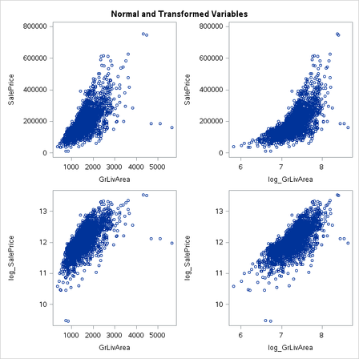
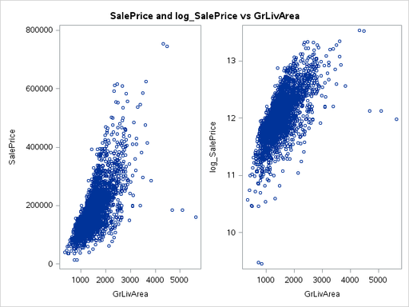
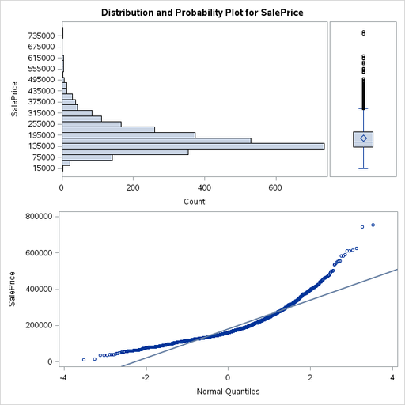
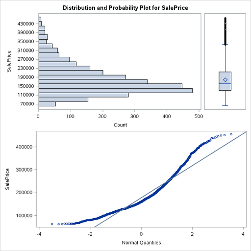

% Assignment 3: Regression Model Building Continued
% Andrew G. Dunn^1^
% ^1^andrew.g.dunn@u.northwestern.edu

\vfill

**Andrew G. Dunn, Northwestern University Predictive Analytics Program**

Prepared for PREDICT-410: Regression & Multivariate Analysis.

Formatted using markdown, pandoc, and \LaTeX\. References managed using Bibtex,
and pandoc-citeproc.

\newpage

# Transformations -- Comparisons of $Y$ versus $log(Y)$

## Data Transformation

~~~{.fortran}
title 'Assignment 3';

libname mydata '/scs/crb519/PREDICT_410/SAS_Data/' access=readonly;

* create a temporary variable (data source is read only);
* we will also do some transformations and only keep,;
* the variables that we're interested in for this study.;
data ames;
    set mydata.ames_housing_data;
    log_SalePrice = log(SalePrice);
    log_GrLivArea = log(GrLivArea);
    keep SalePrice log_salePrice GrLivArea log_GrLivArea MasVnrArea BsmtUnfSF;

* verify that we did indeed carry over the variables of interest;
proc print data=ames (obs=5);
~~~

From this we see that we've retained the variables of interest for our study:

| Obs |MasVnrArea | BsmtUnfSF | GrLivArea | SalePrice | log_SalePrice | log_GrLivArea |
|:-:|:-:|:-:|:-:|:-:|:-:|:-:|
| 1 | 112 | 441 | 1656 | 215000 | 12.2784 | 7.41216 |
| 2 | 0 | 270 | 896 | 105000 | 11.5617 | 6.79794 |
| 3 | 108 | 406 | 1329 | 172000 | 12.0552 | 7.19218 |
| 4 | 0 | 1045 | 2110 | 244000 | 12.4049 | 7.65444 |
| 5 | 0 | 137 | 1629 | 189900 | 12.1543 | 7.39572 |

Table: Variables kept within Data Set

\newpage

We'll look at the transformed variables in relation to our choice predictor
variable:

It's interesting to see that of the four combinations, the combination of both
scaled variables appears to be generally most linear.

## Model Comparisons

We'll now compare the following models:

$$\text{SalePrice} = \beta_0 + \beta_1\text{GrLivArea} + \epsilon$$
$$\text{SalePrice} = \beta_0 + \beta_1\text{log\_GrLivArea} + \epsilon$$
$$\text{log\_SalePrice} = \beta_0 + \beta_1\text{GrLivArea} + \epsilon$$
$$\text{log\_SalePrice} = \beta_0 + \beta_1\text{log\_GrLivArea} + \epsilon$$

~~~{.fortran}
proc reg data=ames;
  model SalePrice = GrLivArea;
  model SalePrice = log_GrLivArea;
  model log_SalePrice = GrLivArea;
  model log_SalePrice = log_GrLivArea;
run;
~~~

\newpage

Which yields the following parameters estimates:

| Variable | DF | Parameter Estimate | Standard Error | t Value | $\text{Pr} > |t|$ |
|:-:|:-:|:-:|:-:|:-:|:-:|
| Intercept | 1 | 13290 | 3269.70277 | 4.06 | <0.0001 |
| GrLivArea | 1 | 111.69400 | 2.06607 | 54.06 | <0.0001 |

Table: Model: $\text{SalePrice} = 13290 + 111.694 \times \text{GrLivArea}$

As the independent variable is not transformed in this model, a one unit
increase in the independent variable would result in an average change in the
mean of the dependent variable by 111.694.

| Variable | DF | Parameter Estimate | Standard Error | t Value | $\text{Pr} > |t|$ |
|:-:|:-:|:-:|:-:|:-:|:-:|
| Intercept | 1 | -1060765 | 23758 | -44.65 | <0.0001 |
| log_GrLivArea | 1 | 171011 | 3269.11261 | 52.31 | <0.0001 |

Table: Model: $\text{SalePrice} = 171011 \times \text{log\_GrLivArea} - 1060765$

As the independent variable is log-transformed in this model, a one unit
increase in the independent variable would result in an average change in the
mean of the dependent variable by $\frac{171011}{100}$ percent.

| Variable | DF | Parameter Estimate | Standard Error | t Value | $\text{Pr} > |t|$ |
|:-:|:-:|:-:|:-:|:-:|:-:|
| Intercept | 1 | 11.17954 | 0.01694 | 660.12 | <0.0001 |
| GrLivArea | 1 | 0.00056107 | 0.00001070 | 52.43 | <0.0001 |

Table: Model: $\text{log\_SalePrice} = 11.17954 + 0.00056 \times \text{GrLivArea}$

As the dependent variable is log-transformed in this model, a one unit increase
in the independent variable would result in an average change in the mean of the
dependent variable by $0.00056 \times 100$ percent.

| Variable | DF | Parameter Estimate | Standard Error | t Value | $\text{Pr} > |t|$ |
|:-:|:-:|:-:|:-:|:-:|:-:|
| Intercept | 1 | 5.43019 | 0.11644 | 46.63 | <0.0001 |
| log_GrLivArea | 1 | 0.90781 | 0.01602 | 56.66 | <0.0001 |

Table: Model: $\text{log\_SalePrice} = 5.43019 + 0.90781 \times \text{log\_GrLivArea}$

As both the dependent and independent variables are log-transformed in this
model, a one percent increase in the independent variable would result in an
average change in the mean of the dependent variable by 0.90781 percent.

\newpage

We'll now aggregate the regression diagnostic information and make a simple
comparison of the models.

| Model | Adj R-Square | F Value |
|:-:|:-:|:-:|
|$\text{SalePrice} = 171011 \times \text{log\_GrLivArea} - 1060765$| 0.4994 | 2922.59 |
|$\text{log\_SalePrice} = 11.17954 + 0.00056 \times \text{GrLivArea}$| 0.4829 | 2736.45 |
|$\text{log\_SalePrice} = 11.17954 + 0.00056 \times \text{GrLivArea}$| 0.4840 | 2748.89 |
|$\text{log\_SalePrice} = 5.43019 + 0.90781 \times \text{log\_GrLivArea}$| 0.5228 | 3209.97 |

Table: Comparison of re-expressed $\text{SalePrice} = 13290 + 111.694 \times \text{GrLivArea}$ models

If we solely look at these criteria, then we would conclude that the model that
was 'best' based on explanation of variability in SalePrice would be the model
that uses a log-transform of both SalePrice and GrLivArea. We can also look at
the F Value to see that the independent and dependent variable log-transform
model best first the population from which the data were sampled.

Examination of the models graphically reinforced our initial assumption that the
transformation of both dependent and independent variables looked to be much
more linear than alternatives. We see on the QQ-Plot of the log-transformed
dependent and independent variable model that the representation is lightly
tailed, but appears to be more normal than the other models.

There are still some outliers that we should be concerned about with this model
fit. The model may have powerful explanatory power, however its current fit
certainly incorporates some outliers from the data set.

In our reading [@statssxc:transforms] we've found that non-linear re-expression
of the variables may be necessary when any of the following apply:

 - The residuals have a skewed distribution. The purpose of a transformation is to obtain residuals that are approximately symmetrically distributed.
 - The spread of the residuals changes systematically with the values of the dependent variable. The purpose of the transformation is to remove that systematic change in spread, achieving approximate homoscedasticity.
 - A desire to linearize a relationship.
 - When the context of the data expects, e.g. chemistry concentrations are expressed commonly as logarithms.
 - A desire to simplify the model, e.g. when a log-transform can simplify the number and complexity of interaction terms.

Furthermore, a log-transform is specifically indicated instead of another
transform when:

 - The residuals have a "strongly" positively skewed distribution. Tukey in [@tukey1977exploratory] provides quantitative ways to estimate the transformation based on rank statistics of the residuals. However, it domes down to: if a log-transform symmetrizes the residuals it was likely the right re-expression.
 - When the standard deviation of the residuals is directly proportional to the fitted values.
 - When the relationship is close to exponential.

Some non-reasons to use a re-expression include:

 - Making outliers look less like outliers. Wuber in [@statssxc:transforms] states: an outlier is a datum that does not fit some parsimonious relatively simple description of the data. To change one's perspective to make outliers look better is usually an incorrect reversal of priorities.
 - Letting the software automatically do it (without you're desiring so).
 - When making 'bad' data appear to be well behaved.
 - For visualization. If you need a re-expression for visualization, ensure that you're not doing it within the model also.

\newpage

## Correlations to $log(SalePrice)$

~~~{.fortran}
proc corr data=ames nosimple rank;
  var log_saleprice;
  with GrLivArea MasVnrArea BsmtUnfSF BsmtFinSF1 FirstFlrSF TotalBsmtSF GarageArea;
  run;
~~~

| Variable  | Pearson Correlation Coefficients  | Prob > $|r|$ under $H_0$: $\rho$=0 | Number of Observations |
|:-:|:-:|:-:|:-:|
| GrLivArea | 0.69586 | <.0001 | 2930 |
| GarageArea | 0.65113 | <.0001 | 2929 |
| TotalBsmtSF | 0.62510 | <.0001 | 2929 |
| FirstFlrSF | 0.60263 | <.0001 | 2930 |
| MasVnrArea | 0.44861 | <.0001 | 2907 |

Table: Correlation of continuous variables to $log(SalePrice)$

We'll now examine how the GrLivArea variable looks with the non transformed and
log-transformed SalePrice variable:

We see immediately that there is a scaling difference, which is to be expected
from our transformation. If we ignored or were oblivious to the scaling, we
might think that the transformed variable graph has less outliers. We refer back
above where it was stated: that making bad data appear good, or doing
transformations specifically for visualization purposes would not be reason
enough to accept the transform.

\newpage

## Remarks on Transformations

We made some detailed remarks above on log-transformation in particular,
transformation in general is not a strictly rule based activity, moreover it
likely should be considered an art. Hubor in [@statssxc:transformsvar] states:
One transforms the _dependent_ variable to achieve approximate _symmetry_ and
_homoscedasticity_ of the _residuals_. Where as transformations of the
_independent_ variable are meant to achieve _linear relationships_ with the
_dependent_ variable.

Hubor further states that in principle there is typically nothing special about
how the data are originally expressed, so one should let the data suggest
re-expressions that lead to effective, accurate, useful, and theoretically
justified models.

In examining the base model $\text{SalePrice} = \beta_0 + \beta_1\text{GrLivArea} + \epsilon$
we observe that the relationship between SalePrice and GrLivArea appear to be
linear. We therefor will create a transformation on the dependent variable:
$$\sqrt{\text{SalePrice}} = \beta_0 + \beta_1\text{GrLivArea} + \epsilon$$

We will compare the models:
$$\text{SalePrice} = \beta_0 + \beta_1\text{GrLivArea} + \epsilon$$
$$\sqrt{\text{SalePrice}} = \beta_0 + \beta_1\text{GrLivArea} + \epsilon$$

And we'll take the best performing model from above:

$$\text{log\_SalePrice} = 5.43019 + 0.90781 \times \text{log\_GrLivArea}$$

| Model | Adj R-Square | F Value |
|:-:|:-:|:-:|
|$\text{SalePrice} = 13290 + 111.694 \times \text{GrLivArea}$| 0.4994 | 2922.59 |
|$\sqrt{\text{SalePrice}} = 232.93209 + 0.12225 \times \text{GrLivArea}$| 0.5073 | 3017.28 |
|$\text{log\_SalePrice} = 5.43019 + 0.90781 \times \text{log\_GrLivArea}$| 0.5228 | 3209.97 |

Table: Comparison of re-expressed $\text{SalePrice} = 13290 + 111.694 \times \text{GrLivArea}$ Models

We feel that our chosen transform of the dependent variable to chase approximate
_symmetry_ and _homoscedasticity_ of the _residuals_ was a good choice. It
performs better than the non re-expressed model, however performs slightly worse
than the log transformed model from above.

\newpage

# Outliers

## Identify Outliers in SalePrice, Prune based on a Removal Strategy

Within SAS there is the univariate procedure, which can be used to identify
outliers and extreme observations. We'll use this to examine SalePrice:

~~~{.fortran}
proc univariate normal plot data=ames;
    var SalePrice;
    histogram SalePrice / normal (color=red w=5);
~~~

We can see at least a single outlier showing up at the top of the  histogram.
Looking at the normal probability plot for SalePrice we observe that the line is
curved, which suggests a skewed distribution. We also observe some outliers in
this depiction of the data.

We'll manually inspect the lowest and highest five observations:

| Observation | Value | Type |
|:-----------:|:-----:|:----:|
| 182 | 12789 | Lowest |
| 1554 | 13100 | Lowest |
| 727 | 34900 | Lowest |
| 2844 | 35000 | Lowest |
| 2881 | 35311 | Lowest |
| 45 | 611657 | Highest |
| 1064 | 615000 | Highest |
| 2446 | 625000 | Highest |
| 1761 | 745000 | Highest |
| 1768 | 755000 | Highest |

Table: Extreme Observations of SalePrice

We'll also consider the Quantiles:

| Level | Quantile |
|:-----:|:--------:|
| 100% Max | 755000 |
| 99% | 457347 |
| 95% | 335000 |
| 90% | 281357 |
| 75% Q3 | 213500 |
| 50% Median | 160000 |
| 25% Q1 | 129500 |
| 10% | 105250 |
| 5% | 87500 |
| 1% | 61500 |
| 0% Max | 12789 |

Table: Quantiles

If this were a formal analysis we would spend a great deal of time examining a
list of the outliers to find out if some of them were clearly _impossible_. In
just a quick glance, at the low end, we could see that there was possibility of
at least one substantive outlier, and on the top end there was two observations
made a few measurements apart that have close to the same value (and both are
outliers).

\newpage

We look at the data (histogram) while laying over a normal distribution.
However, we've already stated that it's unlikely that the distribution of
observations is normal. In the 'olden' days before we had 256GB of memory
(dornick) readily at our fingertips, and decades of statistical software
development to tap into, we would consider examining the two standard deviation
rule. There are data sets that easily show that this rule isn't applicable to
all analyses projects. We'll take a stab at establishing a three bucket outlier
processing system using the 99% and 1% quantile values as our high and low band
passes, even if it's likely to be a bad mechanism for outlier elimination:

~~~{.fortran}
* three bucket outlier classification;
data outliers;
    set ames;
    keep SalePrice GrLivArea MasVnrArea BsmtUnfSF;
    if SalePrice <= 61500 then price_outlier = 1;
    else if SalePrice > 61500 & SalePrice < 457347 then price_outlier = 2;
    else if SalePrice >= 457347 then price_outlier = 3;
    keep SalePrice price_outlier GrLivArea MasVnrArea BsmtUnfSF

proc sort data=outliers;
    by price_outlier;

* means of each outlier bucket;
proc means data=outliers;
    by price_outlier;
    var SalePrice;
~~~

We'll create a new data set by pruning all the outliers at the low and high end
of our data set:

~~~{.fortran}
* prune the outlier data into a new data set;
data pruned;
    set outliers;
    if price_outlier = 1 then delete;
    if price_outlier = 3 then delete;

proc univariate normal plot data=pruned;
    var SalePrice;
    histogram SalePrice / normal (color=red w=5);
~~~

\newpage

We will use the univariate procedure again to examine how our data looks now:

We now observe that the outliers on both side of this tailed data set have been
pruned. The line is still curved, and the histogram is shifted, indicating that
we have data that is not necessarily normal in distribution.

From this visual inspection alone we feel little confidence that our outlier
identification methodology was sane for this data set. We'll carry forward to
examine how pushing the data set farther from normal will impact the model
performance.

We'll now manually inspect the lowest and highest five observations again:

| Observation | Value | Type |
|:-----------:|:-----:|:----:|
| 546 | 62383 | Lowest |
| 731 | 62500 | Lowest |
| 744 | 63000 | Lowest |
| 757 | 63900 | Lowest |
| 2602 | 64000 | Lowest |
| 435 | 445000 | Highest |
| 1027 | 446261 | Highest |
| 1656 | 450000 | Highest |
| 420 | 451950 | Highest |
| 1606 | 455000 | Highest |

Table: Extreme Observations of SalePrice (Outlier Pruned)

We'll also consider the Quantiles:

| Level | Quantile |
|:-----:|:--------:|
| 100% Max | 455000 |
| 99% | 405000 |
| 95% | 320000 |
| 90% | 275500 |
| 75% Q3 | 212900 |
| 50% Median | 160000 |
| 25% Q1 | 130000 |
| 10% | 107950 |
| 5% | 91000 |
| 1% | 75000 |
| 0% Max | 62383 |

Table: Quantiles (Outlier Pruned)

From this we see that our outlier removal procedure executed correctly, however
from comparing the tables and looking at the histograms we don't feel our
methodology was sound. It is in our interest to continue with this data set so
that we can examine how the performance of linear regression if affected.

\newpage

## Model Comparison on Modified Data Set

We will now compare some simple models with both the original data set and the
new data set we've made that removes our classified outliers. The models we're
going to compare are:

$$\text{SalePrice} = \beta_0 + \beta_1\text{GrLivArea} + \epsilon$$
$$\text{SalePrice} = \beta_0 + \beta_1\text{GrLivArea} + \beta_2\text{MasVnrArea} + \epsilon$$
$$\text{SalePrice} = \beta_0 + \beta_1\text{GrLivArea} + \beta_2\text{MasVnrArea} + \beta_3\text{BsmtUnfSF} + \epsilon$$

We will use $\text{SalePrice}$ as the dependent variable identification for the
non-manipulated data set, and $\text{SalePrice}_0$ for the manipulated data set.

After running the regressions, the respective model fits are as follows for the
non-manipulated data set:

$$\text{SalePrice} = 13316 +  111.50225 \times \text{GrLivArea}$$
$$\text{SalePrice} = 26596 + 94.57781 \times \text{GrLivArea} + 118.54037 \times \text{MasVnrArea}$$
$$\text{SalePrice} = 25788 + 93.91175 \times \text{GrLivArea} + 118.57390 \times \text{MasVnrArea} + 3.23138 \times \text{BsmtUnfSF}$$

After running the regressions, the respective model fits are as follows for the
manipulated data set:

$$\text{SalePrice}_0 = 31604 +  98.20384 \times \text{GrLivArea}$$
$$\text{SalePrice}_0 = 40449 + 85.89009 \times \text{GrLivArea} + 997.44693 \times \text{MasVnrArea}$$
$$\text{SalePrice}_0 = 39321 + 84.92176 \times \text{GrLivArea} + 97.45046 \times \text{MasVnrArea} + 4.61086 \times \text{BsmtUnfSF}$$

We'll not walk through interpreting each of these models, as we've not done any
transformations on the dependent or independent variables its safe to say that
we will be dealing with unit changes rather than percentage changes.

\newpage

The diagnostic model performance information is below:

| Model | Adj R-Square | F Value |
|:--|:-:|:-:|
|$\text{SalePrice} = 13316 +  111.50225 \times \text{GrLivArea}$| 0.5002 | 2908.60 |
|$\text{SalePrice} = 26596 + 94.57781 \times \text{GrLivArea} + 118.54037 \times \text{MasVnrArea}$| 0.5594 | 1844.94 |
|$\text{SalePrice} = 25788 + 93.91175 \times \text{GrLivArea} + 118.57390 \times \text{MasVnrArea} + 3.23138 \times \text{BsmtUnfSF}$| 0.5595 | 1231.02 |
||||
|$\text{SalePrice}_0 = 31604 +  98.20384 \times \text{GrLivArea}$| 0.4577 | 2403.02 |
|$\text{SalePrice}_0 = 40449 + 85.89009 \times \text{GrLivArea} + 997.44693 \times \text{MasVnrArea}$| 0.5063 | 1460.07 |
|$\text{SalePrice}_0 = 39321 + 84.92176 \times \text{GrLivArea} + 97.45046 \times \text{MasVnrArea} + 4.61086 \times \text{BsmtUnfSF}$| 0.5069 | 976.10 |

Table: Comparison of model performance with non-manipulated and manipulated data set

We cannot do direct comparison of the Adj R-Square and F Value between the two
sets of models, as these calculations are within the context of the model fit to
the data set. We can however remark about what the removal of our classified
outliers has done to the model performance.

As stated before, we were a bit aggressive with our outlier classification
methodology. In this case we can confidently say that the performance of the
models was degraded by our outlier removal. If we were to assume that our
outlier classification was actually rigorous and based in both domain knowledge,
then we may begin to look for the construction of different models.

That is to say, by having two different data sets and comparing regression
performance, the practitioner can look at the respective model performance
objectively. If you were certain that you 'cleaned' data set was more
representative of the phenomena you wanted to model, then observing degradation
in model performance would tell you that your initial models we're fitting well
to a different phenomena (influenced by the outliers).

\newpage

# Conclusion / Reflection

Transformation and outlier deletion are two highly influential techniques that
we can use to influence the model fit, and potentially model robustness. There
are characteristics of data that give indication that this technique may be
required, however the application of the technique is highly procedural and
requires interpretation.

When we begin to examine the Goodness-of-Fit criteria, we can observe if there
are indicators that mean we should employ either of these techniques.

There are some cases where it is absolutely necessary to use these techniques,
as in scenarios where you can confirm that during collection you've received
observations that truly are not representative of the phenomena your modeling,
or if the variable transformation is required within the professional domain
(e.g. pH, concentrations).

The next steps in the modeling process for this data set would be to see if
there is other data that can be used to begin an attempt at model validation. It
may be valuable at this time to present the initial model findings to the
business owner. In this case, our initial assessment is that a categorical
variable performs the best for explaining variability of Sale Price. If the
Business Owner doesn't want us to use a categorical variable, or would rather we
use a multi-variable approach to include both continuous and categorical
variables it would be best to know that before proceeding to validation.

\newpage

# Straitening Relationships

--------------------------------------------------------------------------------
 Power              Name            Comment
------------------- --------------- --------------------------------------------
 $2$                Square          Try with unimodal distributions that are
                                    skewed to the left

 $1$                Raw data        Data with positive and negative values and
                                    no bounds are less likely to benefit from
                                    re-expression

 $\frac{1}{2}$      Square root     Counts often benefit from a square root
                                    re-expression

 $0$                Logarithms      Measurements that cannot be negative often
                                    benefit from a log re-expression

 $-\frac{1}{2}$     Reciprocal      An uncommon re-expression, but sometimes
                    square root     useful

 $-1$               Reciprocal      Ratios of two quantities often benefit from
                                    a reciprocal
--------------------------------------------------------------------------------
Table: The Ladder of Powers

--------------------------------------------------------------------------------
 Model Name  $x$-axis  $y$-axis  Comment
------------ --------- --------- -----------------------------------------------
 Exponential $x$       $log(y)$  This model is the "0" power in the ladder
                                 approach, useful for values that grow by
                                 percentage increases

 Logarithmic $log(x)$  $y$       A wide range of $x$-values, or a scatterplot
                                 descending rapidly at the left but leveling off
                                 towards the right

 Power       $log(x)$  $log(y)$  The Goldilocks model: when one of the ladder's
                                 powers is too big and the next is too small,
                                 this may be just right
--------------------------------------------------------------------------------
Table:  Attack of the Logarithms

\newpage

# Procedures

~~~{.fortran}
title 'Assignment 3';

libname mydata '/scs/crb519/PREDICT_410/SAS_Data/' access=readonly;

* create a temporary variable (data source is read only);
* we will also do some transformations and only keep,;
* the variables that we're interested in for this study.;
data ames;
    set mydata.ames_housing_data;
    log_SalePrice = log(SalePrice);
    log_GrLivArea = log(GrLivArea);
    sqrt_SalePrice = sqrt(SalePrice);
    keep SalePrice log_salePrice sqrt_SalePrice GrLivArea log_GrLivArea MasVnrArea BsmtUnfSF BsmtFinSF1 FirstFlrSF TotalBsmtSF GarageArea;

ods graphics on;

* verify that we did indeed carry over the variables of interest;
proc print data=ames (obs=5);

* lets look at the linearity of the transformations;
proc sgscatter data=ames;
    title 'Normal and Transformed Variables';
    plot (SalePrice log_SalePrice) * (GrLivArea log_GrLivArea);

* comparing models where we do some re-expression;
proc reg data=ames;
    model SalePrice = GrLivArea;
    model SalePrice = log_GrLivArea;
    model log_SalePrice = GrLivArea;
    model log_SalePrice = log_GrLivArea;

* correlation with our re-expressed dependent variable;
proc corr data=ames nosimple rank;
  var GrLivArea MasVnrArea BsmtUnfSF BsmtFinSF1 FirstFlrSF TotalBsmtSF GarageArea;
  with log_saleprice;
  run;

proc sgscatter data=ames;
    title 'SalePrice and log_SalePrice vs GrLivArea';
    plot (SalePrice log_SalePrice) * GrLivArea;

proc reg data=ames;
    model SalePrice = GrLivArea;

proc reg data=ames;
    model sqrt_SalePrice = GrLivArea;

* identify outliers in SalePrice;
proc univariate normal plot data=ames;
    var SalePrice;
    histogram SalePrice / normal (color=red w=5);

* three bucket outlier classification;
data outliers;
    set ames;
    keep SalePrice price_outlier GrLivArea MasVnrArea BsmtUnfSF;
    if SalePrice <= 61500 then price_outlier = 1;
        else if SalePrice > 61500 & SalePrice < 457347 then price_outlier = 2;
        else if SalePrice >= 457347 then price_outlier = 3;

proc sort data=outliers;
    by price_outlier;

* means of each outlier bucket;
proc means data=outliers;
    by price_outlier;
    var SalePrice;

* prune the outlier data into a new data set;
data pruned;
    set outliers;
    if price_outlier = 1 then delete;
        else if price_outlier = 3 then delete;

proc univariate normal plot data=pruned;
    var SalePrice;
    histogram SalePrice / normal (color=red w=5);

* regression model for non-manipulated data set;
proc reg data=ames;
    model SalePrice = GrLivArea;
    model SalePrice = GrLivArea MasVnrArea;
    model SalePrice = GrLivArea MasVnrArea BsmtUnfSF;

* regression model for non-manipulated data set;
proc reg data=pruned;
    model SalePrice = GrLivArea;
    model SalePrice = GrLivArea MasVnrArea;
    model SalePrice = GrLivArea MasVnrArea BsmtUnfSF;

run;
~~~

\newpage

# References