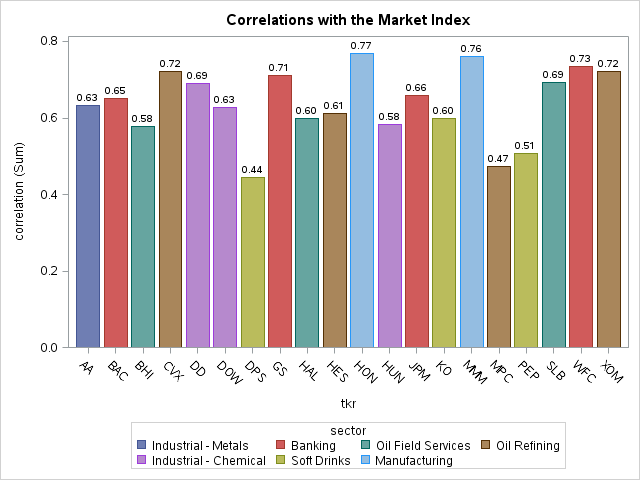

% Assignment 6: Principal Components in Predictive Modeling
% Andrew G. Dunn^1^
% ^1^andrew.g.dunn@u.northwestern.edu

\vfill

**Andrew G. Dunn, Northwestern University Predictive Analytics Program**

Prepared for PREDICT-410: Regression & Multivariate Analysis.

Formatted using markdown, pandoc, and \LaTeX\. References managed using Bibtex,
and pandoc-citeproc.

\newpage

# Goals \& Data Examination

Our data set consists of daily closing stock prices for twenty stocks and a
large-cap index fund from Vanguard (VV). Our data ranges from January 3rd 2012
to December 31st 2013, a record for each day in our data set. We don't appear to
have any gaps (skipping a day) or null values in our data set. We begin by
computing the log return of each stock/index variable. We define return: $r_i$
at a time $i$, where $p_i$ is the price at time $i$ and $j = (i - 1)$:

$$r_i = \frac{p_i - p_j}{p_j}$$

Where log-return is simply: $log(r_i)$, and time $i$ is in days. We use return
instead of price because it provides a mechanism of normalization, which allows
us to have a measurement of all variables in a comparable metric, thus enabling
evaluation of analytical relationships amongst two or more variables despite
originating from a price series of unequal values [@quantitivity:logreturns]. We
wish to use the log- returns of the individual stocks to explain the variation
in log-returns of the market index (VV). We will explore this concept using both
linear regression and principal components analysis as a preconditioner for
linear regression analysis.

# Correlation between log-return and Market Index

Our Pearson Correlation of the log-return to the Vanguard Index:

| Observation | Correlation | Ticker | Sector |
|:-----------:|:-----------:|:------:|:-------|
| 1 | 0.63241 | AA  | Industrial - Metals |
| 2 | 0.65019 | BAC | Banking |
| 3 | 0.57750 | BHI | Oil Field Services |
| 4 | 0.72090 | CVX | Oil Refining |
| 5 | 0.68952 | DD | Industrial - Chemical |
| 6 | 0.62645 | DOW | Industrial - Chemical |
| 7 | 0.44350 | DPS | Soft Drinks |
| 8 | 0.71216 | GS | Banking |
| 9 | 0.59750 | HAL | Oil Field Services |
| 10 | 0.61080 | HES | Oil Refining |
| 11 | 0.76838 | HON | Manufacturing |
| 12 | 0.58194 | HUN | Industrial - Chemical |
| 13 | 0.65785 | JPM | Banking |
| 14 | 0.59980 | KO | Soft Drinks |
| 15 | 0.76085 | MMM | Manufacturing |
| 16 | 0.47312 | MPC | Oil Refining |
| 17 | 0.50753 | PEP | Soft Drinks |
| 18 | 0.69285 | SLB | Oil Field Services |
| 19 | 0.73357 | WFC | Banking |
| 20 | 0.72111 | XOM | Oil Refining |

Table: Ticker Correlation to Vanguard Index Fund

# Visualizing Correlation between log-return and Market Index

# Correlation between log-return mean by Sector and Market Index

| Observation | Sector | Type | Frequency | Mean Correlation |
|:-----------:|:-------|:----:|:---------:|:----------------:|
| 1 | Banking      | 1 | 4 | 0.68844 |
| 2 | Industrial - Chemical      | 1 | 3 | 0.63264 |
| 3 | Industrial - Metals | 1 | 1 | 0.63241 |
| 4 | Manufacturing       | 1 | 2 | 0.76461 |
| 5 | Oil Field Services  | 1 | 3 | 0.62262 |
| 6 | Oil Refining | 1 | 4 | 0.63148 |
| 7 | Soft Drinks  | 1 | 3 | 0.51694 |

Table: Mean Sector Correlation to Vanguard Index Fund

# Principal Components

How many should we keep and why?

Plotting the two first eigenvectors, do we see relationships in the data?
Do we see any groupings in the plot of the first two eigenvectors?

# Segment Data Set into Train/Test

# Regression Model

fit using all individual stocks with the training set.

Goodness of fit analysis

analyze the Variation Inflation Factors

Does this model have a multicollinearity problem?

MSE and MAE Computation of training and testing samples

# Regression Model with Principal Components

Goodness of fit analysis

Analyze the Variation Inflation Factors

Does this model have a multicollinearity problem?

MSE and MAE Computation of training and testing samples

# Model Comparison

Compare the models, which model fits better

\newpage

# Conclusion / Reflection

# Procedures

~~~{.fortran}

~~~

\newpage

# References