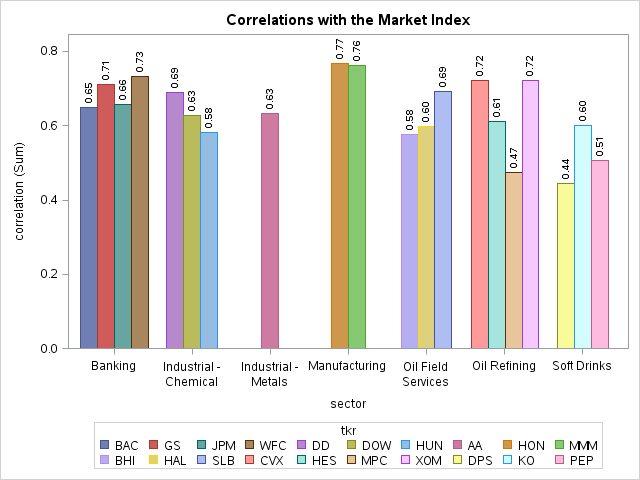
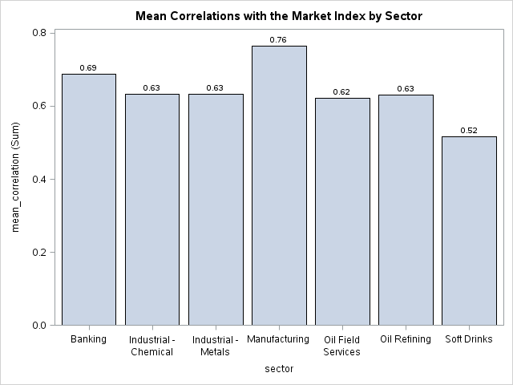
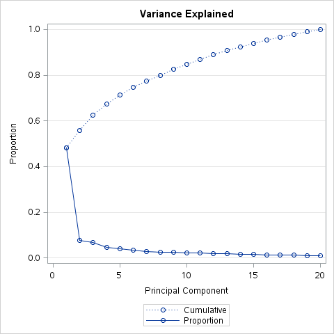
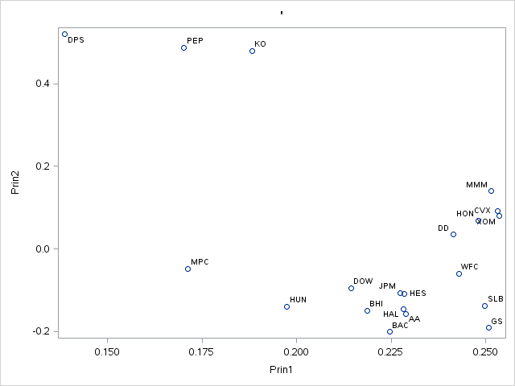

% Assignment 6: Principal Components in Predictive Modeling
% Andrew G. Dunn^1^
% ^1^andrew.g.dunn@u.northwestern.edu

\vfill

**Andrew G. Dunn, Northwestern University Predictive Analytics Program**

Prepared for PREDICT-410: Regression & Multivariate Analysis.

Formatted using markdown, pandoc, and \LaTeX\. References managed using Bibtex,
and pandoc-citeproc.

\newpage

# Goals \& Data Examination

Our data set consists of daily closing stock prices for twenty stocks and a
large-cap index fund from Vanguard (VV). Our data ranges from January 3rd 2012
to December 31st 2013, a record for each day in our data set (501 days). We don't appear to
have any gaps (skipping a day) or null values in our data set. We begin by
computing the log return of each stock/index variable. We define return: $r_i$
at a time $i$, where $p_i$ is the price at time $i$ and $j = (i - 1)$:

$$r_i = \frac{p_i - p_j}{p_j}$$

Where log-return is simply: $log(r_i)$, and time $i$ is in days. We use return
instead of price because it provides a mechanism of normalization, which allows
us to have a measurement of all variables in a comparable metric, thus enabling
evaluation of analytical relationships amongst two or more variables despite
originating from a price series of unequal values [@quantitivity:logreturns]. We
wish to use the log- returns of the individual stocks to explain the variation
in log-returns of the market index (VV). We will explore this concept using both
linear regression and principal components analysis as a preconditioner for
linear regression analysis.

As with any data set we'll have some basis of contextual knowledge and from that
we'll likely be looking to have assumptions validated or broken. For this data
set, an example assumption would be that, the context of market sector is a
valuable grouping mechanism. Furthermore, we assume to see that sector that are
heavily price regulated (banking, energy) would have similar correlations to a
large market index.

With this study we plan to build a model where we have the stock values (or a
normalized re-expression) as independent variables, and the large market index
Vanguard (VV) as the dependent variable.

# Correlation between log-return and Market Index

When we perform the PearsonCorr we get back a wide dataset, meaning that the
variables in this vector are in a left to right orientation. This isn't the best
for examining, and we're going to make some graphics later that will require the
data to be transposed into long format. Once transposed we create a separate
data set with each ticker and their respective sector. We sort both the
transposed to long correlation data set as well as the new ticker and sector
data set by ticker, then merge them. We are then able to print a table of the
Pearson Correlations of log-return to the Vanguard Index, to include each ticker
respective sector:

| Observation | Correlation | Ticker | Sector |
|:-----------:|:-----------:|:------:|:-------|
| 1 | 0.63241 | AA  | Industrial - Metals |
| 2 | 0.65019 | BAC | Banking |
| 3 | 0.57750 | BHI | Oil Field Services |
| 4 | 0.72090 | CVX | Oil Refining |
| 5 | 0.68952 | DD | Industrial - Chemical |
| 6 | 0.62645 | DOW | Industrial - Chemical |
| 7 | 0.44350 | DPS | Soft Drinks |
| 8 | 0.71216 | GS | Banking |
| 9 | 0.59750 | HAL | Oil Field Services |
| 10 | 0.61080 | HES | Oil Refining |
| 11 | 0.76838 | HON | Manufacturing |
| 12 | 0.58194 | HUN | Industrial - Chemical |
| 13 | 0.65785 | JPM | Banking |
| 14 | 0.59980 | KO | Soft Drinks |
| 15 | 0.76085 | MMM | Manufacturing |
| 16 | 0.47312 | MPC | Oil Refining |
| 17 | 0.50753 | PEP | Soft Drinks |
| 18 | 0.69285 | SLB | Oil Field Services |
| 19 | 0.73357 | WFC | Banking |
| 20 | 0.72111 | XOM | Oil Refining |

Table: Ticker Correlation to Vanguard Index Fund

We want to examine the table above by creating a bar chart where we plot the
correlation on the Y-axis, but group the tickers by sector on the X-axis. We
will vary the color of each ticker so that it is easier to discerne:

It is interesting to see that the manufacturing sector has similar correlation,
as well as the banking sector. Surprising to us based on first assumption, the
oil refining sector doesn't have a similar set of correlations. We had some
initial assumptions about sectors that have heavy price regulation all having
similar correlation to a large market identifier. We will now examine the mean
correlation by sector, the data table:

| Observation | Sector | Type | Frequency | Mean Correlation |
|:-----------:|:-------|:----:|:---------:|:----------------:|
| 1 | Banking      | 1 | 4 | 0.68844 |
| 2 | Industrial - Chemical      | 1 | 3 | 0.63264 |
| 3 | Industrial - Metals | 1 | 1 | 0.63241 |
| 4 | Manufacturing       | 1 | 2 | 0.76461 |
| 5 | Oil Field Services  | 1 | 3 | 0.62262 |
| 6 | Oil Refining | 1 | 4 | 0.63148 |
| 7 | Soft Drinks  | 1 | 3 | 0.51694 |

Table: Mean Sector Correlation to Vanguard Index Fund

We want to examine the table above by creating a bar chart:

We observe that the manufacturing sector seems to have the highest correlation,
and all other sectors aside from soft drinks have a similar correlation. Instead
of doing the calculation prior, and producing the table above, we could have
used special functionality within SAS to perform the mean calculation for us at
the time of rendering the graphic.

# Principal Components

We create a new data set to exclude the Market Index as when we calculate our
principle components we don't want the dependent variable within the data set.
We can use a trick when we call the set directive within SAS, passing in the
keep statement, as well as 'return_:' using the colon as a wild-card to match
all of our previously calculated log-return tickers.

We will use SAS princomp to calculate the eigenvectors as well as produce a
scree plot. We'll look at the text output of the princomp procedure, as well as
visually examine the scree plot, all with the intent to come up with some
criteria for which principle components we plan to take forward into our
regression modeling. If we had some arbitrary threshold for variability
explanation, we'd be doing some simple calculations with eigenvalues to see how
we can exceed that threshold. We'll examine the eigenvalues:

| Observation | Eigenvalue | Difference | Proportion | Cumulative |
|:-----------:|:----------:|:----------:|:----------:|:----------:|
| 1  | 9.63645075 | 8.09792128 | 0.4818 | 0.4818 |
| 2  | 1.53852947 | 0.19109235 | 0.0769 | 0.5587 |
| 3  | 1.34743712 | 0.39975791 | 0.0674 | 0.6261 |
| 4  | 0.94767921 | 0.15217268 | 0.0474 | 0.6735 |
| 5  | 0.79550653 | 0.12909860 | 0.0398 | 0.7133 |
| 6  | 0.66640793 | 0.10798740 | 0.0333 | 0.7466 |
| 7  | 0.55842052 | 0.04567198 | 0.0279 | 0.7745 |
| 8  | 0.51274854 | 0.01590728 | 0.0256 | 0.8002 |
| 9  | 0.49684126 | 0.03250822 | 0.0248 | 0.8250 |
| 10 | 0.46433304 | 0.03089374 | 0.0232 | 0.8482 |
| 11 | 0.43343929 | 0.02568332 | 0.0217 | 0.8699 |
| 12 | 0.40775598 | 0.05667006 | 0.0204 | 0.8903 |
| 13 | 0.35108592 | 0.01597897 | 0.0176 | 0.9078 |
| 14 | 0.33510695 | 0.03813712 | 0.0168 | 0.9246 |
| 15 | 0.29696984 | 0.02068234 | 0.0148 | 0.9394 |
| 16 | 0.27628750 | 0.01692712 | 0.0138 | 0.9532 |
| 17 | 0.25936037 | 0.01730228 | 0.0130 | 0.9662 |
| 18 | 0.24205809 | 0.02020002 | 0.0121 | 0.9783 |
| 19 | 0.22185807 | 0.01013445 | 0.0111 | 0.9894 |
| 20 | 0.21172363 | -          | 0.0106 | 1.0000 |

Table: Eigenvalues of the Correlation Matrix

\newpage

We now look at a scree plot that is overlay with the cumulative values from the
table above:

The Scree plot gives us a very quick and simple mechanism for evaluating the set
of calculated principal components and how each one of them contributes to the
overall variability within the data set. From both the table and the Scree
diagram we can decide on our own strategy for what principal components will be
taken to regression modeling. For example, if our threshold for explanation of
variability was 80%, we would take the first eight principal components.

\newpage

Furthermore, we'll perform a sanity check and examine the first two principle
component vectors to see if we notice any relationship within the data:

Within this graph we notice two clusters. We examine the tickers within each
cluster to see if they belong to the same sector and find that not to be true.
Initially, we had an expectation that we would see HES, HAL, AA all be within
the banking sector. We don't see any way to reason through why these clusters
are occurring. With many tickers, it would take a while, we could sit and
examine within this graph to see what tickers are directly related (positive on
either axis) and what tickers are inversely related (negative on either axis).

# Segment PCA Data Set into Train/Test

We'll split the original data set into training and test groups, 70% of the data
being selected at random to be within the training group. We will use the merge
feature within the SAS data directive to merge the original log-return
calculations in with the principle components. On the rows that we flag as part
of our training set we assign the response_VV to a new variable train_response.

\newpage

# Regression Model

We fit a regression model using all of the raw predictor variables. We examine
the diagnostic output:

| Source | DF | Sum of Squares | Mean Square | F Value | Pr > F |
|:------:|:--:|:--------------:|:-----------:|:-------:|:------:|
| Model | 20 | 0.01790 | 0.00089510 | 140.04 | < 0.0001 |
| Error | 317 | 0.00203 | 0.00000639 | | |
| Corrected Total | 317 | 0.01993 | | |

Table: Analysis of Variance

| Source |   |
|:------:|:-:|
| Root MSE | 0.00253 |
| Dependent Mean | 0.00061635 |
| Coeff Var | 410.18453 |
| R-Square | 0.8983 |
|Adj R-Square | 0.8919 |

Table: Model Performance

We see that the R-Square and Adj. R-Square are high. We expected this as we know
when we incorporate all variables into the model due to:

 - Implicitly, $R^2$ is a function of the number of parameters in the model. For a nested subset of predictor variables $p_0 < p_1$, i.e. $p_1$ contains the original $p_0$ predictor variables and some new predictor variables, $R^2$ will have a monotonic relationship such athat $R^2(p_0) \leq R^2(p_1)$.

We note our F Value so that we can compare with other models, we also note that
it is significant and now need to examine the parameter estimates:

| Variable | DF | Parameter Estimate | Standard Error | t-Value | Pr > $|t|$ | Variance Inflation |
|:--------:|:--:|:------------------:|:--------------:|:-------:|:----------:|:------------------:|
| Intercept  | 1 | 0.00008640 | 0.00014092 | 0.61  | 0.5403 | 0.00000 |
| return_AA  | 1 | 0.01769    | 0.01317    | 1.34  | 0.1802 | 2.11490 |
| return_BAC | 1 | 0.03198    | 0.01165    | 2.75  | 0.0064 | 3.10927 |
| return_BHI | 1 | -0.00111   | 0.01323    | -0.08 | 0.9333 | 2.62997 |
| return_CVX | 1 | 0.04907    | 0.02536    | 1.93  | 0.0539 | 3.07524 |
| return_DD  | 1 | 0.04674    | 0.02037    | 2.29  | 0.0224 | 2.51406 |
| return_DOW | 1 | 0.03642    | 0.01162    | 3.14  | 0.0019 | 1.88893 |
| return_DPS | 1 | 0.03670    | 0.01679    | 2.19  | 0.0295 | 1.54768 |
| return_GS  | 1 | 0.04849    | 0.01555    | 3.12  | 0.0020 | 3.10450 |
| return_HAL | 1 | 0.00948    | 0.01466    | 0.65  | 0.5184 | 3.08758 |
| return_HES | 1 | 0.00359    | 0.01092    | 0.33  | 0.7425 | 2.10199 |
| return_HON | 1 | 0.12213    | 0.01924    | 6.35  | <.0001 | 2.73505 |
| return_HUN | 1 | 0.02712    | 0.00836    | 3.24  | 0.0013 | 1.79852 |
| return_JPM | 1 | 0.00902    | 0.01708    | 0.53  | 0.5979 | 3.36439 |
| return_KO  | 1 | 0.07903    | 0.02226    | 3.55  | 0.0004 | 1.93633 |
| return_MMM | 1 | 0.09796    | 0.02646    | 3.70  | 0.0003 | 2.98277 |
| return_MPC | 1 | 0.01673    | 0.00809    | 2.07  | 0.0394 | 1.32999 |
| return_PEP | 1 | 0.02911    | 0.02231    | 1.30  | 0.1929 | 1.68825 |
| return_SLB | 1 | 0.03776    | 0.01709    | 2.21  | 0.0279 | 3.13690 |
| return_WFC | 1 | 0.07587    | 0.01848    | 4.10  | <.0001 | 2.59492 |
| return_XOM | 1 | 0.05467    | 0.02697    | 2.03  | 0.0435 | 2.98393 |

Table: Parameter Estimates

It's pretty safe to say that our nose should be detecting the presence of
multicollinearity, we see that we have a significant F Value and almost all of
the independent variables have a non-significant t-test. We examine the Variance
Inflation Factor of the $k^{th}$ predictor as:

$$ VIF_k = \frac{1}{1-R^2_k}$$

where $R^2_k$ is the R-Square value obtained by regressing the $k^{th}$ predictor
on the remaining predictors. $VIF_k$ tells us how much the variance of the
estimated regression coefficient $\beta_k$ is "inflated" by the existence of
correlation among the predictor variables in the model. A rule of thumb is if
$VIF_k > 10$ then multicollinearity is considered to be high. We see that none
of the predictors has a VIF higher than 4, however we see many of the predictors
having a close to 4 value (which is considered another lower threshold for VIF
calculations). It is generally desired that we achieve a $VIF_k$ value close to
1.0.

\newpage

# Regression Model with Principal Components

We fit a regression model using the eight selected principal components. We
examine the diagnostic output:

| Source | DF | Sum of Squares | Mean Square | F Value | Pr > F |
|:------:|:--:|:--------------:|:-----------:|:-------:|:------:|
| Model | 8 | 0.01776 | 0.00222 | 337.13 | < 0.0001 |
| Error | 329 | 0.00217 | 0.00000659 | | |
| Corrected Total | 337 | 0.01993 | | |

Table: Analysis of Variance

| Source |   |
|:------:|:-:|
| Root MSE | 0.00257 |
| Dependent Mean | 0.00061635 |
| Coeff Var | 416.36522 |
| R-Square | 0.8913 |
|Adj R-Square | 0.8886 |

Table: Model Performance

Initially we note that the F Value has increased over our last model, albiet the
R-Square and Adj. R-Square have decreased slightly. We examine the parameter
estimates:

| Variable | DF | Parameter Estimate | Standard Error | t-Value | Pr > $|t|$ | Variance Inflation |
|:--------:|:--:|:------------------:|:--------------:|:-------:|:----------:|:------------------:|
| Intercept | 1 | 0.00075978  | 0.00014045 | 5.41  | <.0001 | 0.00000 |
| Prin1     | 1 | 0.00231     | 0.00004519 | 51.05 | <.0001 | 1.00527 |
| Prin2     | 1 | 0.00032245  | 0.00011425 | 2.82  | 0.0051 | 1.00868 |
| Prin3     | 1 | 0.00070635  | 0.00012322 | 5.73  | <.0001 | 1.00861 |
| Prin4     | 1 | 0.00030481  | 0.00014536 | 2.10  | 0.0368 | 1.00636 |
| Prin5     | 1 | -0.00017356 | 0.00015516 | -1.12 | 0.2641 | 1.00297 |
| Prin6     | 1 | 0.00000315  | 0.00017108 | 0.02  | 0.9853 | 1.00766 |
| Prin7     | 1 | -0.00010331 | 0.00018604 | -0.56 | 0.5791 | 1.02315 |
| Prin8     | 1 | -0.00040760 | 0.00020293 | -2.01 | 0.0454 | 1.02271 |

Table: Parameter Extimates

We observe that the first three independent variables are significant. This is
an improvement over the last model. We observe that independent variable four
through eight are not significant, but in examining the $VIF_k$ of each
predictor variable we observe them all to be close to one.

# Model Comparison \& Conclusions

We observe that between the two models, the model based on the log-return
variables has significant signs of multicollinearity. The model based on the
first eight principal components has less of an indication of multicollinearity.
The principal components model has a larger F Value, while both models have a
significant measure of F Value. We'll compute the Mean Square Error (MSE) and
Mean Absolute Error (MAE) to further compare the models. We calculate the MSE
as:

$$ MSE = \frac{1}{n}\sum^n_{i=1}(\hat{Y_i} - Y_i)^2$$

Where $\hat{Y}$ is a vector of $n$ predictions, and $Y$ is the vector of the
true values. MSE assesses the quality of an estimator or set of predictions in
terms of its variation and degree of bias. We calculate the MAE as:

$$MAE = \frac{1}{n}\sum^n_{i=1}|\hat{Y_i} - Y_i|$$

Where $\hat{Y}$ is a vector of $n$ predictions, and $Y$ is the vector of the
true values. MAE is an average of the absolute error within the model.In both
cases we want to see that the calculated values are minimized.We will perform
both calculations on the training and test data:

| Observation | Training | MSE_1 | MAE_1 | MSE_2 | MAE_2 |
|:-----------:|:--------:|:-----:|:-----:|:-----:|:-----:|
| 1 | 0 | 0.000009306 | 0.002144904 | 0.000009677 | 0.002179249 |
| 2 | 1 | 0.000005994 | 0.001902032 | 0.000006410 | 0.001975239 |

Table: Mean Square Error \& Mean Absolute Error

Overall the difference between models when looking at MSE and MAE is small.
The percent difference, to normalize the comparison, is:

       MSE training  3.9867%
       MSE Test      6.9403%
       MAE Training  1.6012%
       MAE Test      3.8489%

Overall, we have to favor the second model for a variety of reasons:

 - Significantly fewer parameters, making the model simpler to interpret. Although the caveat of for interpretation is explaining dimensionality reduction to a business owner.
 - Less obvious presence of multicollinearity with low $VIF_k$ on each parameter
 - Better Goodness-of-Fit with a higher F-Value, and relatively the same R-Square, and Adj. R-Square

With the first model having obvious multicollinearity using PCA as a
preprocessor for regression gave us the ability to address multicollinearity by
reducing the amount of parameters we use in the model (while still accounting
for a tunable (our choice) amount of variability from the data set.

\newpage

# Procedures

~~~{.fortran}
* William T. Mickelson ;
* 5-5-2015  ;
* portfolio_pca.sas;

libname mydata "/scs/wtm926/" access=readonly;

data temp;
  set mydata.stock_portfolio_data;
run;

proc print data=temp(obs=10); run; quit;
proc sort data=temp; by date; run; quit;

data temp;
  set temp;

  * Compute the log-returns - log of the ratio of today's price to yesterday's price;
  * Note that the data needs to be sorted in the correct 
    direction in order for us to compute the correct return;
  return_AA  = log(AA/lag1(AA));
  return_BAC = log(BAC/lag1(BAC));
  return_BHI = log(BHI/lag1(BHI));
  return_CVX = log(CVX/lag1(CVX));
  return_DD  = log(DD/lag1(DD));
  return_DOW = log(DOW/lag1(DOW));
  return_DPS = log(DPS/lag1(DPS));
  return_GS  = log(GS/lag1(GS));
  return_HAL = log(HAL/lag1(HAL));
  return_HES = log(HES/lag1(HES));
  return_HON = log(HON/lag1(HON));
  return_HUN = log(HUN/lag1(HUN));
  return_JPM = log(JPM/lag1(JPM));
  return_KO  = log(KO/lag1(KO));
  return_MMM = log(MMM/lag1(MMM));
  return_MPC = log(MPC/lag1(MPC));
  return_PEP = log(PEP/lag1(PEP));
  return_SLB = log(SLB/lag1(SLB));
  return_WFC = log(WFC/lag1(WFC));
  return_XOM = log(XOM/lag1(XOM));
  *return_VV  = log(VV/lag1(VV));
  response_VV = log(VV/lag1(VV));
run;

proc print data=temp(obs=10); run; quit;

* We can use ODS TRACE to print out all of the data sets available to ODS for a particular SAS procedure.;
* We can also look these data sets up in the SAS User's Guide in the chapter for the selected procedure.;
*ods trace on;
ods output PearsonCorr=portfolio_correlations;
proc corr data=temp;
*var return: with response_VV;
var return_:;
with response_VV;
run; quit;
*ods trace off;

proc print data=portfolio_correlations; run; quit;

data wide_correlations;
  set portfolio_correlations (keep=return_:);
run;

* Note that wide_correlations is a 'wide' data set and we need a 'long' data set;
* SAS has two 'standard' data formats - wide and long;
* We can use PROC TRANSPOSE to convert data from one format to the other;
proc transpose data=wide_correlations out=long_correlations;
run; quit;

data long_correlations;
  set long_correlations;
  tkr = substr(_NAME_,8,3);
  drop _NAME_;
  rename COL1=correlation;
run;

proc print data=long_correlations; run; quit;

* Merge on sector id and make a colored bar plot;
data sector;
input tkr $ 1-3 sector $ 4-35;
datalines;
AA  Industrial - Metals
BAC Banking
BHI Oil Field Services
CVX Oil Refining
DD  Industrial - Chemical
DOW Industrial - Chemical
DPS Soft Drinks
GS  Banking
HAL Oil Field Services
HES Oil Refining
HON Manufacturing
HUN Industrial - Chemical
JPM Banking
KO  Soft Drinks
MMM Manufacturing
MPC Oil Refining
PEP Soft Drinks
SLB Oil Field Services
WFC Banking
XOM Oil Refining
VV  Market Index
;
run;

proc print data=sector; run; quit;

proc sort data=sector; by tkr; run;
proc sort data=long_correlations; by tkr; run;

data long_correlations;
  merge long_correlations (in=a) sector (in=b);
  by tkr;
  if (a=1) and (b=1);
run;

proc print data=long_correlations; run; quit;

* Make Grouped Bar Plot;
* p. 48 Statistical Graphics Procedures By Example;
ods graphics on;
title 'Correlations with the Market Index';
proc sgplot data=long_correlations;
  format correlation 3.2;
  vbar tkr / response=correlation group=sector groupdisplay=cluster datalabel;
run; quit;
ods graphics off;

* Still not the correct graphic.  We want the tickers grouped and color coded by sector;
* We want ticker labels directly under the x-axis and sector labels under the ticker
  labels denoting each group.  Looks like we have an open SAS graphics project.;
ods graphics on;
title 'Correlations with the Market Index';
proc sgplot data=long_correlations;
  format correlation 3.2;
  vbar sector / response=correlation group=tkr groupdisplay=cluster datalabel;
run; quit;
ods graphics off;

* SAS can produce bar plots by sector of the mean correlation;
proc means data=long_correlations nway noprint;
class sector;
var correlation;
output out=mean_correlation mean(correlation)=mean_correlation;
run; quit;

proc print data=mean_correlation; run;

ods graphics on;
title 'Mean Correlations with the Market Index by Sector';
proc sgplot data=mean_correlation;
  format mean_correlation 3.2;
  vbar sector / response=mean_correlation datalabel;
run; quit;
ods graphics off;

* Note that we have been using PROC SGPLOT to display a data summary, and hence we have not
  been able to make the display that we want.  In reality PROC SGPLOT is designed to take an
  input data set, perform some routine data summaries, and display that output.  Unfortunately,
  routine data summaries are typically frequency counts for discrete data or averages for
  contiuous data.  Here is an example of the default use of PROC SGPLOT.;
ods graphics on;
title 'Mean Correlations with the Market Index by Sector - SGPLOT COMPUTES MEANS';
proc sgplot data=long_correlations;
  format correlation 3.2;
  vbar sector / response=correlation stat=mean datalabel;
run; quit;
ods graphics off;

* Reset title statement to blank;
title '';

************************************************************************************;
* Begin Modeling;
************************************************************************************;
* Note that we do not want the response variable in the data used to compute the
  principal components;

data return_data;
  set temp (keep= return_:);
  * What happens when I put this keep statement in the set statement?;
  * Look it up in The Little SAS Book;
run;

proc print data=return_data(obs=10); run;

************************************************************************************;
* Compute Principal Components;
************************************************************************************;
ods graphics on;
proc princomp data=return_data out=pca_output outstat=eigenvectors plots=scree(unpackpanel);
run; quit;
ods graphics off;
* Notice that PROC PRINCOMP produces a lot of output;
* How many principal components should we keep?;
* Do the principal components have any interpretability?;
* Can we display that interpretability using graphics?;

proc print data=pca_output(obs=10); run;

proc print data=eigenvectors(where=(_TYPE_='SCORE')); run;
* Display the two plots and the Eigenvalue table from the output;

* Plot the first two eigenvectors;
data pca2;
  set eigenvectors(where=(_NAME_ in ('Prin1','Prin2')));
  drop _TYPE_ ;
run;

proc print data=pca2; run;

proc transpose data=pca2 out=long_pca; run; quit;
proc print data=long_pca; run;

data long_pca;
  set long_pca;
  format tkr $3.;
  tkr = substr(_NAME_,8,3);
  drop _NAME_;
run;

proc print data=long_pca; run;

* Plot the first two principal components;
ods graphics on;
proc sgplot data=long_pca;
scatter x=Prin1 y=Prin2 / datalabel=tkr;
run; quit;
ods graphics off;

************************************************************************************;
* Create a training data set and a testing data set from the PCA output             ;
* Note that we will use a SAS shortcut to keep both of these 'datasets' in one      ;
* data set that we will call cv_data (cross-validation data).                       ;
************************************************************************************;
data cv_data;
  merge pca_output temp(keep=response_VV);
  * No BY statement needed here.  We are going to append a column in its current order;
  * generate a uniform(0,1) random variable with seed set to 123;
  u = uniform(123);
  if (u < 0.70) then train = 1;
  else train = 0;

  if (train=1) then train_response=response_VV;
  else train_response=.;

run;

proc print data=cv_data(obs=10); run;

* You can double check this merge by printing out the original data;
proc print data=temp(keep=response_VV obs=10); run; quit;

********************************************************************************************;
* Fit a regression model using the raw predictor variables;
********************************************************************************************;
* Fit a regression model using all of the raw predictor variables and VV as the response variable;

ods graphics on;
proc reg data=cv_data;
model train_response = return_: / vif ;
output out=model1_output predicted=Yhat ;
run; quit;
ods graphics off;
* Examine the Goodness-Of-Fit for this model.  How well does it fit?  Are there any problems?;

********************************************************************************************;
* Fit a regression model using the rotated predictor variables (Principal Component Scores) ;
********************************************************************************************;
* Now fit a regression model using your selected number of principal components and VV as
  the response variable;
* Examine the Goodness-Of-Fit for this model.  How well does it fit?  Are there any problems?;

ods graphics on;
proc reg data=cv_data;
model train_response = prin1-prin8 / vif ;
output out=model2_output predicted=Yhat  ;
run; quit;
ods graphics off;

********************************************************************************************;
* Compare fit and predictive accuracy of the two fitted models ;
********************************************************************************************;
* Use the Mean Square Error (MSE) and the Mean Absolute Error (MAE) metrics for your comparison.;

proc print data=model1_output(obs=10); run;

* Model 1;
data model1_output;
  set model1_output;
  square_error = (response_VV - Yhat)**2;
  absolute_error = abs(response_VV - Yhat);
run;

proc means data=model1_output nway noprint;
class train;
var square_error absolute_error;
output out=model1_error
  mean(square_error)=MSE_1
  mean(absolute_error)=MAE_1;
run; quit;

proc print data=model1_error; run;

* Model 2;
data model2_output;
  set model2_output;
  square_error = (response_VV - Yhat)**2;
  absolute_error = abs(response_VV - Yhat);
run;

proc means data=model2_output nway noprint;
class train;
var square_error absolute_error;
output out=model2_error
  mean(square_error)=MSE_2
  mean(absolute_error)=MAE_2;
run; quit;

proc print data=model2_error; run;

* Merge them together in one table;
data error_table;
  merge model1_error(drop= _TYPE_ _FREQ_) model2_error(drop= _TYPE_ _FREQ_);
  by train;
run;

proc print data=error_table; run;
* Which model fits better? Did we benefit from using PCA? ;
* In our analysis did we do anything that might not be 100% kosher? ;
* Model 2 has higher accuracy both in-sample and out-of-sample, hence we prefer Model 2;
~~~

\newpage

# References