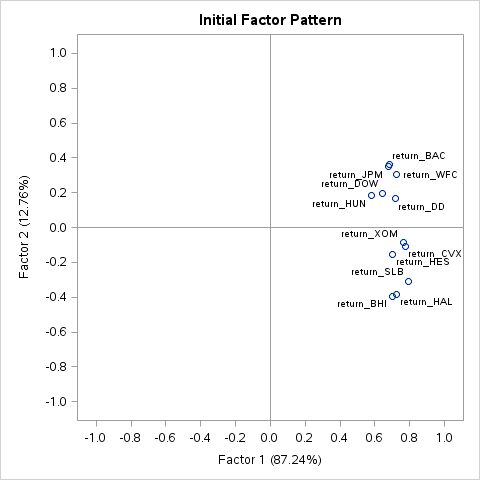

% Assignment 7: Factor Analysis
% Andrew G. Dunn^1^
% ^1^andrew.g.dunn@u.northwestern.edu

\vfill

**Andrew G. Dunn, Northwestern University Predictive Analytics Program**

Prepared for PREDICT-410: Regression & Multivariate Analysis.

Formatted using markdown, pandoc, and \LaTeX\. References managed using Bibtex,
and pandoc-citeproc.

\newpage

# Goals \& Data Examination

Our data set consists of daily closing stock prices for twenty stocks and a
large-cap index fund from Vanguard (VV). Our data ranges from January 3rd 2012
to December 31st 2013, a record for each day in our data set (501 days). We don't appear to
have any gaps (skipping a day) or null values in our data set. We begin by
computing the log return of each stock/index variable. We define return: $r_i$
at a time $i$, where $p_i$ is the price at time $i$ and $j = (i - 1)$:

$$r_i = \frac{p_i - p_j}{p_j}$$

Where log-return is simply: $log(r_i)$, and time $i$ is in days. We use return
instead of price because it provides a mechanism of normalization, which allows
us to have a measurement of all variables in a comparable metric, thus enabling
evaluation of analytical relationships amongst two or more variables despite
originating from a price series of unequal values [@quantitivity:logreturns]. We
will be using factor analysis to identify sectors in the stock market. In order
to get better factor analysis results we will have to drop some values from the
data set. By eliminating these stocks we will be left with four sectors;
Banking, Oil Field Services, Oil Refining, and Industrial - Chemical. Within the
context of factor analysis we hypothesize that we have three or four factors (or
industry sectors) in this data set.

We decide up front that we will set out criteria for significance on the factor
loadings to 0.5. This is chosen arbitrarily, as it is our first time performing
a factor analysis, so that we can be slightly more exclusive with our selection.
Our threshold is saying that we choose to have at least half the variance
accounted for by the factor for each variable.

# Principal Factor Analysis

We will begin by performing a Principal Factor Analysis without a factor
rotation. The SAS procedure we use will automatically select the number of
factors to retain. Factor analysis begins by substituting the diagonal of the
correlation matrix with what are called 'prior communality estimates'. The
communality estimate for a variable is the estimate of the proportion of the
variance of the variable that is both error free and shared with other variables
within the matrix [@factoranalysiswithprocfactor]. We specified this calculation
to be completed using the SMC method, which uses the squared multiple
correlation between the variable and all other variables. We first observe that
the Prior Communality Estimates, and we notice that there are some values that
are getting close to one (greater than 0.6), so at this time we don't know for
sure if the SMC method will be the most appropriate for our modeling. We then
examine the eigenvalues of the reduced correlation matrix:

| Observation | Eigenvalue | Difference | Proportion | Cumulative |
|:-----------:|:----------:|:----------:|:----------:|:----------:|
| 1  | 6.04732583 | 5.16261770 | 0.8812   | 0.8812 |
| 2  | 0.88470813 | 0.52262870 | 0.1289   | 1.0101 |
| 3  | 0.36207942 | 0.05735386 | 0.0528   | 1.0629 |
| 4  | 0.30472556 | 0.29429115 | 0.0444   | 1.1073 |
| 5  | 0.01043441 | 0.06365245 | 0.0015   | 1.1088 |
| 6  | -.05321803 | 0.01517115 | -0.0078  | 1.1011 |
| 7  | -.06838918 | 0.03291807 | -0.0100  | 1.0911 |
| 8  | -.10130725 | 0.01600696 | -0.0148  | 1.0763 |
| 9  | -.11731422 | 0.00866270 | -0.0171  | 1.0593 |
| 10 | -.12597692 | 0.01040221 | -0.0184  | 1.0409 |
| 11 | -.13637913 | 0.00786652 | -0.0199  | 1.0210 |
| 12 | -.14424565 | -          |  -0.0210 | 1.0000 |

Table: Eigenvalues of the Reduced Correlation Matrix

We could examine the Scree plot, however we can see from above that the first
two eigenvalues have a very large proportion of the variance, the first has much
more than the second. This is giving us evidence that the variables within our
model are all highly correlated with each-other and that there is some latent
quality or trait that is giving rise to high correlation amongst the variables.
We are using factor analysis to give some insight into what this quality or
trait is that is underlying the correlation. It is a bit disturbing that we have
a cumulative value that is greater than 1.0 for the first two eigenvalues. We
suspect that this is something to do with the SMC method that we specified.We
examine the loadings of the factor pattern and the respective factor variance:

|   | Factor 1 | Factor 2 |
|:-:|:--------:|:--------:|
| return_BAC | 0.68475 | 0.36021 |
| return_BHI | 0.69984 | -0.39498 |
| return_CVX | 0.77402 | -0.10833 |
| return_DD  | 0.71605 | 0.16703 |
| return_DOW | 0.64548 | 0.19801 |
| return_HAL | 0.72630 | -0.38221 |
| return_HES | 0.70361 | -0.15709 |
| return_HUN | 0.58030 | 0.18186 |
| return_JPM | 0.67874 | 0.34813 |
| return_SLB | 0.79382 | -0.30815 |
| return_WFC | 0.72445 | 0.30517 |
| return_XOM | 0.76500 | -0.08361 |

Table: Factor Pattern

| Factor 1 | Factor 2 |
|:--------:|:--------:|
| 6.0473258| 0.8847081|

Table: Variance Explained by Each Factor

We see that SAS has retained two factors under its default settings. We didn't
specify a MINEIGEN parameter when calling the FACTOR statement, and as we used
the SMC method the SAS manual tells us that the MINEIGEN will be calculated as:

$$ MINEIGEN = \frac{\text{Total Weighted Variance}}{\text{Number of Variables}}$$

Which in our case results in $\frac{6.86244298}{12}=0.57$. Given this
calculation we expect to see two factors, however before we examined the manual
we conceptualized that we would see somewhere between three and four factors
based on our understanding of the data (we knew that we initially scoped our
data to four sectors). Given the second factors sign we are able to
differentiate into two groups. The first appears to subsume both the Banking and
industrial sectors (BAC, DD, DOW, HUN, JPM, WFC), and the second appears to
subsume the Oil refining and field services sectors (BHI, CVX, HAL, HES, SLB,
XOM).

It seems that all of the variables are highly loaded for the first factor, where
as the variables for the second factor don't meet our pre-specified criteria for
loading. If we were to interpret the results systematically, we would produce
the following equation for each variable within our analysis:

$$ X_1 = \lambda{1}f_1 + \lambda{2}f_2 +, \ldots + \lambda{k}f_k + u_1$$

for example, with BAC we would have:

$$\text{return\_BAC} = 0.68475 \times f_1 + 0.36021 \times f_2$$

return_BAC is a good example, if we were strict with our loading criteria we
would not have included the second factor and loading coefficient within the
equation. It is common to choose the dominant (largest) factor and say that the
variable is explained more by the dominant factor (return_BAC is explained more
by factor 1 than factor 2).

If we examine the two factors graphically via the graph below:

We can elicit some creativity, and begin the process of reification. We
attribute meaning of the first factor to be representative of the overall market
and would give it the name 'market'. The second factor we would attribute
meaning of sector differentiation, and thus would give it the name 'sector'. We
notice that the first factor has variables that all pass our loading threshold,
and the second factor does not. This doesn't provide us with much
interpretability, so we must purely look at the sign within the second factor.

\newpage

# Principal Factor Analysis with Rotation (Varimax)

We will now perform a factor analysis with rotation. The rotation is meant to
improve the interpretability of the model. By default the unrotated output
maximizes the variance accounted for by the first and subsequent factors, and
forces the factors to be orthogonal [@wiki:fa]. Rotation serves to make the
output more understandable by seeking a 'simple structure': a pattern of
loadings where items load most strongly on one factor, and much more weakly on
the other factors. We chose to use the Varimax rotation which is an orthogonal
rotation of the factor axes to maximize the variance of the squared loadings of
a factor (column) on all variables (rows) in a factor matrix [@wiki:fa]. We
notice that the factor analysis outputs are the same as above, with new outputs
for the rotation method:

|   | Factor 1 | Factor 2 |
|:-:|:--------:|:--------:|
| return_BAC | 0.73912 | 0.22875 |
| return_BHI | 0.21634 | 0.77394 |
| return_CVX | 0.47133 | 0.62344 |
| return_DD  | 0.62482 | 0.38759 |
| return_DOW | 0.59675 | 0.31582 |
| return_HAL | 0.24408 | 0.78359 |
| return_HES | 0.38705 | 0.60822 |
| return_HUN | 0.53921 | 0.28120 |
| return_JPM | 0.72634 | 0.23305 |
| return_SLB | 0.34419 | 0.77886 |
| return_WFC | 0.72835 | 0.29575 |
| return_XOM | 0.48241 | 0.59958 |

Table: Rotated Factor Pattern

| Factor 1 | Factor 2 |
|:--------:|:--------:|
| 3.4711423| 3.4608916|

Table: Variance Explained by Each Factor

We immediately notice that the interpretability is different for this model. The
rotation has given us the ability to consider each factor as providing close to
the same explanatory value for the variance within the model. Interpreting with
the above decided 0.5 loading threshold allows us to see that Factor 1 is
comprised of BAC, DD, DOW, HUN, JPM, WFC. Factor 2 is comprised of BHI, CVX,
HAL, HES, SLB, XOM. Reification of the factors is much easier in this model. We
can easily say that Factor 1 is comprised of Banking and industrial sectors,
where as Factor 2 is comprised of Oil refining and field services sectors.

What we don't see is a factor that is loaded for a single variable, if we saw
this we would know that we should drop that variable from the model and consider
it independently from the factor analysis.

\newpage

# Maximum Likelihood Factor Analysis with Rotation (Varimax)

We will now perform a maximum likelihood factor analysis with varimax rotation.
This approach requires us to take on several assumptions that we're not
currently validating in our study. The benefit in taking on these assumptions is
that maximum likelihood is a formal estimation procedure that provides us with
formal inference for factor loadings and goodness-of-fit criteria. We observe
that the method computes an initial set of eigenvalues to assess the convergence
criterion. As with above, calculate the MINEIGEN default to be
$\frac{18.8960127}{12}=1.574667725$, meaning we will be getting a model with two
factors. Once the criterion is satisfied, we see that there is two separate
statistical hypothesis test with the null hypothesis stated as 'no common
factors' and '2 factors are sufficient' respectively. Both tests allow us to
accept the null hypothesis. We will skip over the initial output and directly
examine the rotated factor pattern:

|   | Factor 1 | Factor 2 |
|:-:|:--------:|:--------:|
| return_BAC | 0.76122 | 0.21969 |
| return_BHI | 0.21664 | 0.79932 |
| return_CVX | 0.49806 | 0.57530 |
| return_DD  | 0.59542 | 0.38748 |
| return_DOW | 0.56395 | 0.31884 |
| return_HAL | 0.24256 | 0.80907 |
| return_HES | 0.40289 | 0.59153 |
| return_HUN | 0.50588 | 0.29457 |
| return_JPM | 0.75054 | 0.22277 |
| return_SLB | 0.35223 | 0.79376 |
| return_WFC | 0.75994 | 0.27534 |
| return_XOM | 0.51113 | 0.55362 |

Table: Rotated Factor Pattern

| Factor | Weighted | Unweighted |
|:------:|:--------:|:----------:|
| Factor1 | 8.7156851  | 3.55022275 |
| Factor2 | 10.1803287 | 3.42320994 |

Table: Variance Explained by Each Factor

The same amount of common factors are suggested by the maximum likelihood
method. The factor loadings between principal factor analysis and maximum
likelihood with rotations are very similar, leaving no difference in
interpretability. The added benefit we get from a maximum likelihood factor
analysis is the goodness-of-fit criteria. We like that the maximum likelihood
methodology gives us some criterion for model comparison.

\newpage

# Maximum Likelihood Factor Analysis, with Rotation and Max Priors

With the Max priors parameter set its likely that we'll see a drastically
different threshold for accepting factors. Max, from the SAS manual, set the
prior communality estimate for each variable to its maximum absolute correlation
with any other variable. We re-calculate our MINEIGEN default to be
$\frac{27.8241868}{12}=2.318682233$. We would expect, by reading the manual,
that we would only get two factors out of this method, but instead we see five:

|   | Factor 1 | Factor 2 | Factor 3 | Factor 4 | Factor 5 |
|:-:|:--------:|:--------:|:--------:|:--------:|:--------:|
| return_BAC | 0.19300 | 0.75425 | 0.26803 | 0.17215 | 0.09285 |
| return_BHI | 0.75597 | 0.14970 | 0.18684 | 0.24628 | -0.01722 |
| return_CVX | 0.37688 | 0.25354 | 0.26440 | 0.70383 | 0.02658 |
| return_DD  | 0.24372 | 0.27524 | 0.66859 | 0.31138 | -0.13337 |
| return_DOW | 0.19396 | 0.25931 | 0.64481 | 0.23505 | -0.00701 |
| return_HAL | 0.82071 | 0.18978 | 0.20801 | 0.16916 | -0.00609 |
| return_HES | 0.47834 | 0.23976 | 0.25785 | 0.40900 | 0.24903 |
| return_HUN | 0.22592 | 0.26677 | 0.60996 | 0.06709 | 0.16770 |
| return_JPM | 0.20547 | 0.77151 | 0.22874 | 0.17842 | -0.03102 |
| return_SLB | 0.72537 | 0.25575 | 0.24707 | 0.30301 | 0.05701 |
| return_WFC | 0.20847 | 0.61032 | 0.35934 | 0.29285 | -0.00631 |
| return_XOM | 0.37166 | 0.29603 | 0.24083 | 0.66560 | -0.02404 |

Table: Rotated Factor Pattern

| Factor | Weighted | Unweighted |
|:------:|:--------:|:----------:|
| Factor1 | 9.48177257 | 2.55119512 |
| Factor2 | 6.95572063 | 2.08400430 |
| Factor3 | 5.26449075 | 1.82173920 |
| Factor4 | 5.80237050 | 1.59069819 |
| Factor5 | 0.31984016 | 0.12246466 |

Table: Variance Explained by Each Factor

This suggests that the factor selection is highly dependent on the prior
estimates of communalities. The Max priors procedure seems to be a highly
inclusive method for computing communalities. In looking at our rotated factor
patterns above we begin to notice that some of our factors will only be
inclusive of a small subset of our variables (based on loading conditions). If
we look more closely, we see that:

    Factor 1: BHI, HAL, SLB
    Factor 2: BAC, JPM, WFC
    Factor 3: DD, DOW, HUN
    Factor 4: CVX, XOM
    Factor 5: No selections based on loading criterion

Looking back at our last write up, we see that these organizations correspond to
the following:

| Ticker | Sector |
|:------:|:------:|
| BAC | Banking |
| BHI | Oil Field Services |
| CVX | Oil Refining |
| DD | Industrial - Chemical |
| DOW | Industrial - Chemical |
| HAL | Oil Field Services |
| HES | Oil Refining |
| HUN | Industrial - Chemical |
| JPM | Banking |
| SLB | Oil Field Services |
| WFC | Banking |
| XOM | Oil Refining |

Table: Ticker and Sector

As such, what we had expected (factor lines to be drawn by sector) appears to be
occuring within this model. Factor 1 strongly indicates Oil Field services,
Factor 2 strongly indicates Banking, Factor 3 strongly indicates Industrial -
Chemical, Factor 4 strongly indicates Oil Refining. This leaves out HES, which
appears to load more heavily in the Oil Field services Factor than Factor 4,
which we'd expect based on it's sector. Strangely we have a fifth factor that
doesn't have a single varaible within it based on loading criterion.

We'd conclude that the method chosen for priors calculation and communalities is
highly influential over the chosen factors from the model. Using Max got us
closer to what we had initially expected from our familiarity with the data set,
however the fifth factor doesn't provide any explanatory utility and seems an
aberration of the model.

\newpage

# Procedures

~~~{.fortran}
* William T. Mickelson;
* 05-11-2015;
* portfolio_fa;

libname mydata "/scs/wtm926/" access=readonly;

data temp;
  set mydata.stock_portfolio_data;

  * Let's drop some variables to get better factor analysis results;
  drop AA HON MMM DPS KO PEP MPC GS ;
run;

proc print data=temp(obs=10); run; quit;
proc sort data=temp; by date; run; quit;

data temp;
  set temp;
  return_BAC = log(BAC/lag1(BAC));
  return_BHI = log(BHI/lag1(BHI));
  return_CVX = log(CVX/lag1(CVX));
  return_DD  = log(DD/lag1(DD));
  return_DOW = log(DOW/lag1(DOW));
  return_HAL = log(HAL/lag1(HAL));
  return_HES = log(HES/lag1(HES));
  return_HUN = log(HUN/lag1(HUN));
  return_JPM = log(JPM/lag1(JPM));
  return_SLB = log(SLB/lag1(SLB));
  return_WFC = log(WFC/lag1(WFC));
  return_XOM = log(XOM/lag1(XOM));
  *return_VV  = log(VV/lag1(VV));
  response_VV = log(VV/lag1(VV));
run;

proc print data=temp(obs=10); run; quit;

data return_data;
  set temp (keep= return_:);
run;

proc print data=return_data(obs=10); run;

ods graphics on;
proc factor data=return_data method=principal priors=smc rotate=none
  plots=(all);
run; quit;
ods graphics off;

ods graphics on;
proc factor data=return_data method=principal priors=smc rotate=varimax
  plots=(all);
run; quit;
ods graphics off;

ods graphics on;
proc factor data=return_data method=ML priors=smc rotate=varimax
  plots=(loadings);
run; quit;
ods graphics off;

ods graphics on;
proc factor data=return_data method=ML priors=max rotate=varimax
  plots=(loadings);
run; quit;
ods graphics off;
~~~

\newpage

# References