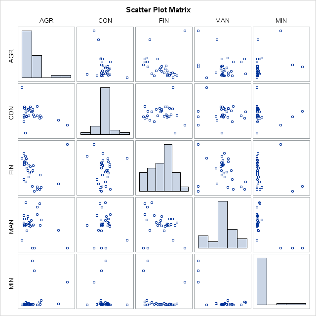
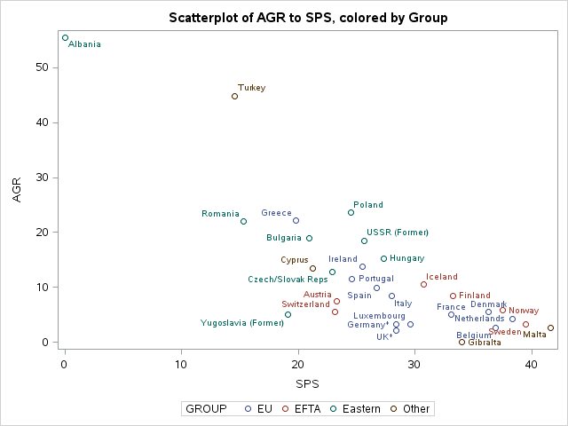
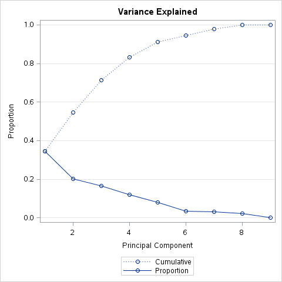
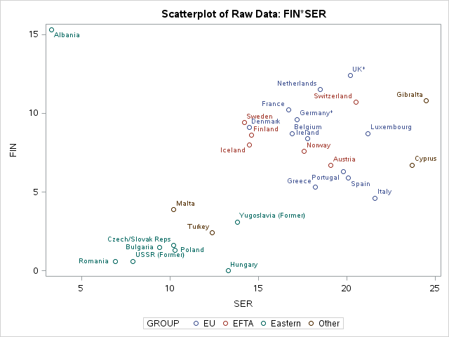
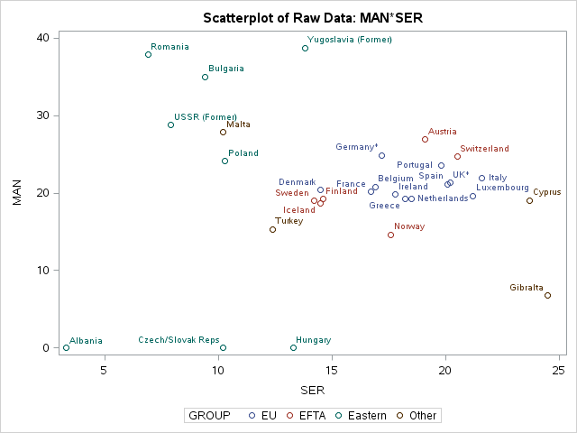
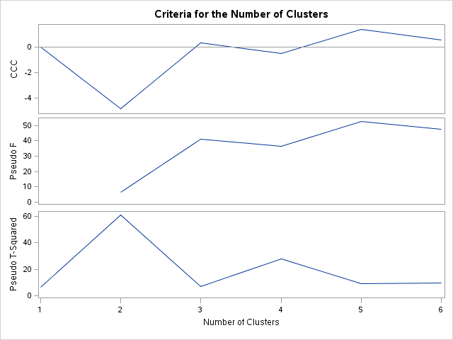
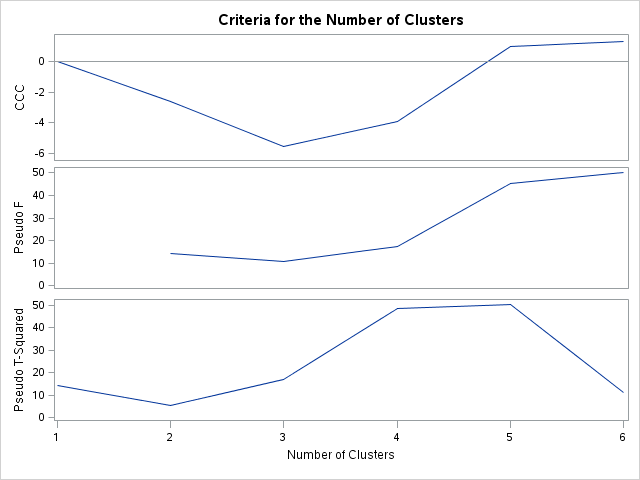

% Assignment 8: Cluster Analysis
% Andrew G. Dunn^1^
% ^1^andrew.g.dunn@u.northwestern.edu

\vfill

**Andrew G. Dunn, Northwestern University Predictive Analytics Program**

Prepared for PREDICT-410: Regression & Multivariate Analysis.

Formatted using markdown, pandoc, and \LaTeX\. References managed using Bibtex,
and pandoc-citeproc.

\newpage

# Goals \& Data Examination

We will be using principal components analysis to reduce dimensionality of a
data set as a preprocessor for cluster analysis. Our data set is employment
reporting for various industry segments, as a percentage measurement, for thirty
European nations.

The Variables in our data set are:

| Variable | Type | Length | Format | Informat |
|:--------:|:----:|:------:|:------:|:--------:|
| AGR     | Num  | 8  | 8.1 | F10.1 |
| CON     | Num  | 8  | 8.1 | F10.1 |
| COUNTRY | Char | 20 | 35. | - |
| FIN     | Num  | 8  | 8.1 | F10.1 |
| GROUP   | Char | 8  | 10. | - |
| MAN     | Num  | 8  | 8.1 | F10.1 |
| MIN     | Num  | 8  | 8.1 | F10.1 |
| PS      | Num  | 8  | 8.1 | F10.1 |
| SER     | Num  | 8  | 8.1 | F10.1 |
| SPS     | Num  | 8  | 8.1 | F10.1 |
| TC      | Num  | 8  | 8.1 | F10.1 |

Table: Alphabetic List of Variables and Attributes

| Variable | Industrial Sector |
|:--------:|:-----------------:|
| AGR | Agriculture |
| MIN | Mining |
| MAN | Manufacturing |
| PS  | Power and Water Supply |
| CON | Construction |
| SER | Services |
| FIN | Finance |
| SPS | Social and Personal Services |
| TC  | Transport and Communications |

Table: Variable and Industrial Sector

We observe that this data set has a variable (group) that provides subdivision
into classes. Examining the contents of group tell us that the subdivision
appears to be by trade bloc. Trade bloc is a type of intergovernmental agreement
where regional barriers to trade are reduced or eliminated amongst the
participating nation-states. The tutorial requires us to examine the data set in
an unsupervised fashion. This group classification would provide us a basis to
perform our exploratory data analysis in a supervised fashion. We'd imagine that
if groupings we're known for a data set, it would be typical to begin
exploratory data analysis from a supervised perspective.

We observe that four countries (Cyprus, Gibralta, Matla, and Turkey) are all
within the 'Other' group. If we were to assume that the group assignment was
purely a basis of local, then we'd consider re-naming the 'Other' category to
something more contextually appropriate, such as 'Mediterranean'. This however
can be misleading as several nation-states from the EU would be considered to be
in the Mediterranean region.

# Correlation and Visualization

We'll begin by examining the simple Pearson correlation for the variables within
our data set, this produces the scatter-plot matrix:

This graphic doesn't fully encompass the correlation matrix. The strongest
correlation, with a statistically significant test, was between AGR and SPS. The
correlation being $0.81148$ with a probability $> |r|$ under $H_0: \rho=0$ test
statistic of $< 0.0001$. Well continue to examine this correlation by producing
a scatter-plot:

\newpage

# Principal Components, Dimensionality Reduction

As we have nine variables within the data set, we'll use PCA as a dimensionality
reduction method. We'll use the variability table, or scree plot to examine how
many components we require to account for 90% of the data variability.

| Observation | Eigenvalue | Difference | Proportion | Cumulative |
|:-----------:|:----------:|:----------:|:----------:|:----------:|
| 1 | 3.11225795 | 1.30302071 | 0.3458 | 0.3458 |
| 2 | 1.80923724 | 0.31301704 | 0.2010 | 0.5468 |
| 3 | 1.49622020 | 0.43277636 | 0.1662 | 0.7131 |
| 4 | 1.06344384 | 0.35318631 | 0.1182 | 0.8312 |
| 5 | 0.71025753 | 0.39891874 | 0.0789 | 0.9102 |
| 6 | 0.31133879 | 0.01791787 | 0.0346 | 0.9448 |
| 7 | 0.29342091 | 0.08960446 | 0.0326 | 0.9774 |
| 8 | 0.20381645 | 0.20380935 | 0.0226 | 1.0000 |
| 9 | 0.00000710 |     0.0000 | 1.0000 | -      |

Table: Eigenvalues of the Correlation Matrix

|   | Prin1 | Prin2 | Prin3 | Prin4 | Prin5 | Prin6 | Prin7 | Prin8 | Prin9 |
|:-:|:-----:|:-----:|:-----:|:-----:|:-----:|:-----:|:-----:|:-----:|:-----:|
| AGR | -.511492 | 0.023475 | -.278591 | 0.016492 | -.024038 | 0.042397 | -.163574 | 0.540409 | 0.582036 |
| MIN | -.374983 | -.000491 | 0.515052 | 0.113606 | 0.346313 | -.198574 | 0.212590 | -.448592 | 0.418818 |
| MAN | 0.246161 | -.431752 | -.502056 | 0.058270 | -.233622 | 0.030917 | 0.236015 | -.431757 | 0.447086 |
| PS  | 0.316120 | -.109144 | -.293695 | 0.023245 | 0.854448 | -.206471 | -.060565 | 0.155122 | 0.030251 |
| CON | 0.221599 | 0.242471 | 0.071531 | 0.782666 | 0.062151 | 0.502636 | -.020285 | 0.030823 | 0.128656 |
| SER | 0.381536 | 0.408256 | 0.065149 | 0.169038 | -.266673 | -.672694 | 0.174839 | 0.201753 | 0.245021 |
| FIN | 0.131088 | 0.552939 | -.095654 | -.489218 | 0.131288 | 0.405935 | 0.457645 | -.027264 | 0.190758 |
| SPS | 0.428162 | -.054706 | 0.360159 | -.317243 | -.045718 | 0.158453 | -.621330 | -.041476 | 0.410315 |
| TC  | 0.205071 | -.516650 | 0.412996 | -.042063 | -.022901 | 0.141898 | 0.492145 | 0.502124 | 0.060743 |

Table: Eigenvectors

\newpage

From the diagnostic output of the PCA procedure we see that we'll have to use
the first five principal components to explain greater than 90% of the
variability in our data. We reluctantly accept this as we made the initial
decision, prior to examining output, to take forward 90% of the explained
variability. It would be more ideal from a ease-of-modeling perspective to take
forward fewer principal components, and in turn less of the explained
variability.

# Cluster Analysis

We'll begin by making some of our own scatter plots, selecting the FIN and SER,
as well as the MAN and SER variables:

With the naked eye we observer two clusters within each of the graphs. There are
some outlier countriers, but in both graphs the Eastern group seems to cluster,
where as the EU and EFTA groups seem to cluster. Albania and Gibralta both seem
to be outliers in their own right. We will use the cluster procedure within SAS
to automatically create clusters with a hierarchical approach. As this is a
hierarchal approach we, as the analyst, do not have to specify the amount of
desired clusters. Instead we can examine diagnostic output for different
criteria and make our decision.  There are no completely satisfactory methods
that can be used for determining the number of population clusters for any type
of cluster analysis [@hartigan1985statistical]. We'll examine the diagnostic
output of the cluster procedure, and look for the Cubic Clustering Criterion
(CCC), Pseudo F, and the Pseudo T-Squared:

We will interpret the measurements with the following assumptions, assuming that
the criterion are all graphed in relation the number of clusters (as it is
above):

- Cubic Clustering Criterion
    + Peaks on the plot with the CCC greater than 2 or 3 indicate good clusterings.
    + Peaks with the CCC between 0 and 2 indicate possible clusters but should be interpreted cautiously.
    + There may be several peaks if the data has a hierarchical structure.
    + Very distinct non-hierarchical spherical clusters usually show a sharp rise before the peak followed by a gradual decline.
    + Very distinct non-hierarchical elliptical clusters often show a sharp rise to the correct number of clusters followed by a further gradual increase and eventually a gradual decline.
    + If all values of the CCC are negative and decreasing for two or more clusters, the distribution is probably unimodal or long-tailed.
    + Very negative values of the CCC, say, -30, may be due to outliers. Outliers generally should be removed before clustering.
- Pseudo F
    + Look for a relatively large value.

From this we conclude (between the CCC and Pseudo F) that we would be likely
happy with at-least three clusters, maybe four.

We use the tree procedure to assign observations to a specified number of
clusters after the hierarchal clustering. We'll examine the tabular output
between the three cluster tree and four cluster tree:

| Group | Albania | CL3 | CL6 | Total |
|:-----:|:-------:|:---:|:---:|:-----:|
| EFTA | 0 | 6 | 0 | 6 |
| EU | 0 | 12 | 0 | 12 |
| Eastern | 1 | 0 | 7 | 8 |
| Other | 0 | 2 | 2 | 4 |
| Total | 1 | 20 | 9 | 30 |

Table: Frequency of Group to Cluster with Three Clusters

| Group | Albania | CL4 | CL5 | CL6 | Total |
|:-----:|:-------:|:---:|:---:|:---:|:-----:|
| EFTA | 0 | 5 | 1 | 0 | 6 |
| EU | 0 | 10 | 2 | 0 | 12 |
| Eastern | 1 | 0 | 0 | 7 | 8 |
| Other | 0 | 1 | 1 | 2 | 4 |
| Total | 1 | 16 | 4 | 9 | 30 |

Table: Frequency of Group to Cluster with Four Clusters

We observe that membership group, for this data set, is a fairly coherent guide
for where classification into clusters will occur. The three cluster table shows
that the existing groups distribute almost solely into a single cluster. Within
the four cluster table we see that EFTA and EU give up some of their members to
be distributed amongst other clusters. For simplicity, and to reinforce the
contextual information within the data set, we'd prefer three clusters.

\newpage

We'll now perform a hierarchical clustering with the principal components data
set.

Using our above assumptions for interpreting the criteria, we conclude (between
the CCC and Pseudo F) that we would be likely happy with at-least five, maybe
six clusters.

We use the tree procedure to assign observations to a specified number of
clusters after the hierarchal clustering. We'll examine the tabular output
between the three cluster tree and four cluster tree:

| Group | Albania | CL3 | Gibralta | Total |
|:-----:|:-------:|:---:|:---:|:-----:|
| EFTA | 0 | 6 | 0 | 6 |
| EU | 0 | 12 | 0 | 12 |
| Eastern | 1 | 7 | 0 | 8 |
| Other | 0 | 3 | 1 | 4 |
| Total | 1 | 28 | 1 | 30 |

Table: Frequency of Group to Cluster with Three Clusters

| Group | Albania | CL4 | CL6 | Gibralta | Total |
|:-----:|:-------:|:---:|:---:|:---:|:-----:|
| EFTA | 0 | 6 | 0 | 0 | 6 |
| EU | 0 | 12 | 0 | 0 | 12 |
| Eastern | 1 | 4 | 3 | 0 | 8 |
| Other | 0 | 2 | 1 | 1 | 4 |
| Total | 1 | 24 | 4 | 1 | 30 |

Table: Frequency of Group to Cluster with Four Clusters

We now see that membership group breaks down a bit. Using the principal
components data set seems to have pushed our clustering towards accentuating the
outlier members within the data. We would prefer using the raw data for
clustering. If the goal of cluster analysis is to group objects that are more
similar (based on some distance methodology), it would seem to be more useful to
have a better distribution of entities into your respective clusters. With the
principal components data set we see that the clusters have a more skewed amount
of membership, as opposed to the raw data set.

We do fear an assumed bias when working with data that already has an indication
of group membership. In the case of this analysis we saw some reinforcement of
that group membership in our initial clustering. This may have been enough to
reinforce analyst bias to an undoubted level.

\newpage

# Procedures

~~~{.fortran}
title 'Assignment 8';
libname mydata '/scs/crb519/PREDICT_410/SAS_Data/' access=readonly;

* create a temporary variable (data source is read only);
title 'Examination of Initial Data Set';
data employ;
  set mydata.european_employment;

proc contents data=employ;

ods graphics on;
proc corr data=employ nomiss plots=matrix(histogram);
   var AGR CON FIN MAN MIN PS SER SPS TC;

title 'Scatterplot of AGR to SPS, colored by Group';
proc sgplot data=employ;
  scatter y=AGR x=SPS / datalabel=country group=group;

title 'Modeling the Data, Dimensionality Reduction';

proc princomp data=employ out=employ_prin outstat=eigenvectors plots=scree(unpackpanel);

*proc print data=eigenvectors(where=(_TYPE_='SCORE'));

title 'Cluster Analysis: Scatter Plots';

proc sgplot data=employ;
  title 'Scatterplot of Raw Data: FIN*SER';
  scatter y=fin x=ser / datalabel=country group=group;

proc sgplot data=employ;
  title 'Scatterplot of Raw Data: MAN*SER';
  scatter y=man x=ser / datalabel=country group=group;

title 'Cluster Analysis: Automated Cluster Selection';
proc cluster data=employ method=average outtree=tree1 pseudo ccc plots=all;
  var fin ser;
  id country;

proc tree data=tree1 ncl=3 out=_3_clusters;
  title 'Three Cluster Tree';
  copy fin ser;

proc tree data=tree1 ncl=4 out=_4_clusters;
  title 'Four Cluster Tree';
  copy fin ser;

* macro function for displaying displaying the assignment of the observations to the determined clusters.;
%macro makeTable(treeout,group,outdata);
  data tree_data;
    set &treeout.(rename=(_name_=country));

  proc sort data=tree_data; by country;

  data group_affiliation;
    set &group.(keep=group country);

  proc sort data=group_affiliation;
    by country;

  data &outdata.;
    merge tree_data group_affiliation;
    by country;

  proc freq data=&outdata.;
    table group*clusname / nopercent norow nocol;

%mend makeTable;

* Call macro function;
%makeTable(treeout=_3_clusters,group=employ,outdata=_3_clusters_with_labels);
%makeTable(treeout=_4_clusters,group=employ,outdata=_4_clusters_with_labels);

proc sgplot data=_3_clusters_with_labels;
  title 'Three Clusters with Labels';
  scatter y=fin x=ser / datalabel=country group=clusname;

proc sgplot data=_4_clusters_with_labels;
  title 'Four Clusters with Labels';
  scatter y=fin x=ser / datalabel=country group=clusname;

proc cluster data=employ_prin method=average outtree=tree3 pseudo ccc plots=all;
  title 'Cluster with Prin1 and Prin2';
  var prin1 prin2;
  id country;

proc tree data=tree3 ncl=3 out=_3_clusters;
  title 'Three Cluster Tree';
  copy prin1 prin2;

proc tree data=tree3 ncl=4 out=_4_clusters;
  title 'Foud Cluster Tree';
  copy prin1 prin2;

%makeTable(treeout=_3_clusters,group=employ,outdata=_3_clusters_with_labels);
%makeTable(treeout=_4_clusters,group=employ,outdata=_4_clusters_with_labels);

proc sgplot data=_3_clusters_with_labels;
  title 'Three Clusters with Labels';
  scatter y=prin2 x=prin1 / datalabel=country group=clusname;

proc sgplot data=_4_clusters_with_labels;
  title 'Four Clusters with Labels';
  scatter y=prin2 x=prin1 / datalabel=country group=clusname;

%makeTable(treeout=_3_clusters,group=employ,outdata=_3_clusters_with_labels);
%makeTable(treeout=_4_clusters,group=employ,outdata=_4_clusters_with_labels);

run;
ods graphics off;
~~~

\newpage

# References